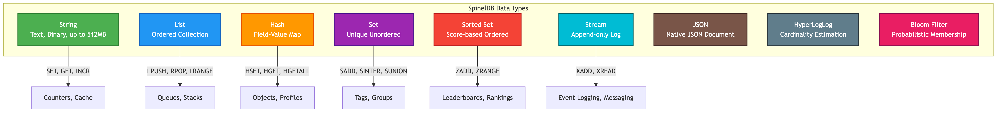

# Chapter 2: Core Data Types & Commands

Welcome to the core of SpinelDB's functionality. If you're familiar with Redis, you'll feel right at home. SpinelDB implements the most popular and powerful Redis data types, allowing you to build complex applications with simple, atomic commands.

This chapter provides a hands-on introduction to each data type, demonstrating the most common commands you'll use in your day-to-day work.

### Data Types Overview



---

## 1. Strings

Strings are the most basic and versatile value type in SpinelDB. They can hold any kind of data, such as text, serialized objects, or binary data, up to 512 MB in size.

**Common Commands:** `SET`, `GET`, `INCR`, `APPEND`, `STRLEN`

### Example Session

Let's perform some basic string operations.

```shell
# Set a simple key-value pair
127.0.0.1:7878> SET user:1:name "Alice"
OK

# Retrieve the value
127.0.0.1:7878> GET user:1:name
"Alice"

# Append to the string
127.0.0.1:7878> APPEND user:1:name " Smith"
(integer) 11

# The value is now updated
127.0.0.1:7878> GET user:1:name
"Alice Smith"

# Use strings as atomic counters
127.0.0.1:7878> SET user:1:visits 100
OK
127.0.0.1:7878> INCR user:1:visits
(integer) 101
```

---

## 2. Lists

Lists are ordered collections of strings, sorted by insertion order. You can think of them as linked lists, which makes it extremely fast to add new elements to either the head (left) or the tail (right) of the list, even with millions of items already inside.

**Common Commands:** `LPUSH`, `RPUSH`, `LRANGE`, `LPOP`, `LLEN`

### Example Session

Let's use a list to manage a queue of tasks.

```shell
# Add a high-priority task to the left (head) of the list
127.0.0.1:7878> LPUSH tasks "review-design"
(integer) 1

# Add two lower-priority tasks to the right (tail)
127.0.0.1:7878> RPUSH tasks "write-docs" "deploy-staging"
(integer) 3

# View all tasks in the list (0 is the first element, -1 is the last)
127.0.0.1:7878> LRANGE tasks 0 -1
1) "review-design"
2) "write-docs"
3) "deploy-staging"

# Process and remove the highest-priority task from the left
127.0.0.1:7878> LPOP tasks
"review-design"

# Check the current length of the list
127.0.0.1:7878> LLEN tasks
(integer) 2
```

---

## 3. Hashes

Hashes are maps between string fields and string values. They are the perfect data type for representing objects, like a user profile or a product entry.

**Common Commands:** `HSET`, `HGET`, `HGETALL`, `HINCRBY`, `HDEL`

### Example Session

Let's store a user object in a hash.

```shell
# Set multiple fields for a user object at once
127.0.0.1:7878> HSET user:100 username "bob" email "bob@example.com" visits 50
(integer) 3

# Get a single field
127.0.0.1:7878> HGET user:100 username
"bob"

# Atomically increment a numeric field
127.0.0.1:7878> HINCRBY user:100 visits 1
(integer) 51

# Retrieve all fields and values in the hash
127.0.0.1:7878> HGETALL user:100
1) "username"
2) "bob"
3) "email"
4) "bob@example.com"
5) "visits"
6) "51"
```

---

## 4. Sets

Sets are unordered collections of unique strings. They are highly optimized for checking membership, finding intersections, and performing unions between different sets.

**Common Commands:** `SADD`, `SISMEMBER`, `SMEMBERS`, `SINTER`, `SCARD`

### Example Session

Let's use sets to manage user groups.

```shell
# Add users to an "online" group. Note that "bob" is added twice but only stored once.
127.0.0.1:7878> SADD users:online "alice" "bob" "carol" "bob"
(integer) 3

# Add users to a "premium" group
127.0.0.1:7878> SADD users:premium "bob" "dave"
(integer) 2

# Check if a user is a member
127.0.0.1:7878> SISMEMBER users:online "alice"
(integer) 1
127.0.0.1:7878> SISMEMBER users:online "eve"
(integer) 0

# Find users who are both online and premium (intersection)
127.0.0.1:7878> SINTER users:online users:premium
1) "bob"

# Get the cardinality (number of members) of the online set
127.0.0.1:7878> SCARD users:online
(integer) 3
```

---

## 5. Sorted Sets (ZSETs)

Sorted Sets are similar to Sets in that they are collections of unique members. However, every member in a Sorted Set is associated with a floating-point number called a **score**. The members are always kept sorted by this score, making them perfect for leaderboards, priority queues, and secondary indexing.

**Common Commands:** `ZADD`, `ZRANGE`, `ZREVRANGE`, `ZSCORE`, `ZRANK`

### Example Session

Let's build a simple game leaderboard.

```shell
# Add players with their scores. The command returns the number of new elements added.
127.0.0.1:7878> ZADD leaderboard 1950 "player-one" 2100 "player-two" 1875 "player-three"
(integer) 3

# Get all players, sorted from lowest to highest score, with their scores
127.0.0.1:7878> ZRANGE leaderboard 0 -1 WITHSCORES
1) "player-three"
2) "1875"
3) "player-one"
4) "1950"
5) "player-two"
6) "2100"

# Get the top 2 players (highest scores first)
127.0.0.1:7878> ZREVRANGE leaderboard 0 1
1) "player-two"
2) "player-one"

# Get the score of a specific player
127.0.0.1:7878> ZSCORE leaderboard "player-three"
"1875"
```

---

## 6. Streams

Streams are a powerful, append-only log data structure. They are more complex than the other types but enable sophisticated messaging and event-sourcing patterns. A stream entry is not just a single value but a map of field-value pairs, similar to a hash. Each entry gets a unique, time-based ID. Streams also have built-in support for consumer groups.

**Common Commands:** `XADD`, `XRANGE`, `XREAD`

### Example Session

Let's model a simple sensor data stream.

```shell
# Add a new entry to the stream. The '*' asks the server to auto-generate an ID.
127.0.0.1:7878> XADD sensor:123 * temp 25.5 humidity 60
"1679589330123-0"

# Add another entry
127.0.0.1:7878> XADD sensor:123 * temp 25.7 humidity 59
"1679589332456-0"

# Read all entries in the stream from beginning (-) to end (+)
127.0.0.1:7878> XRANGE sensor:123 - +
1) 1) "1679589330123-0"
   2) 1) "temp"
      2) "25.5"
      3) "humidity"
      4) "60"
2) 1) "1679589332456-0"
   2) 1) "temp"
      2) "25.7"
      3) "humidity"
      4) "59"

# Read up to 1 new entry starting from the beginning of time (0-0)
127.0.0.1:7878> XREAD COUNT 1 STREAMS sensor:123 0-0
1) 1) "sensor:123"
   2) 1) 1) "1679589330123-0"
         2) 1) "temp"
            2) "25.5"
            3) "humidity"
            4) "60"
```

---

<div className="doc-nav-links">
  <span>⬅️ <strong>Previous Chapter: <a href="./installation-and-setup">1. Installation & Setup</a></strong></span>
  <span>➡️ <strong>Next Chapter: <a href="./native-json">3. Working with JSON Documents</a></strong></span>
</div>
