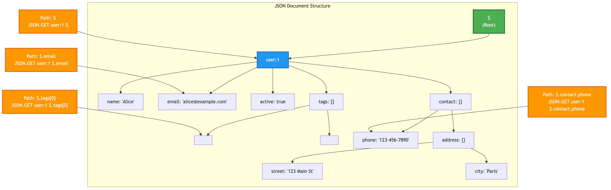

# Chapter 3: Working with JSON Documents

Beyond the core Redis data types, SpinelDB offers built-in, native support for JSON. This allows you to store, retrieve, and manipulate complex, nested JSON documents directly on the server without needing to serialize or deserialize them on the client side.

This is a powerful feature for applications that deal with structured data, such as user profiles, product catalogs, or configuration settings. All operations are atomic, just like with any other SpinelDB data type.

SpinelDB uses a simple JSONPath-like syntax for targeting specific parts of a document.

-   The root of the document is represented by `$`
-   Object keys are accessed using dot notation: `$.user.name`
-   Array elements are accessed using square brackets: `[0]`

These can be combined, for example: `$.products[1].price`

### JSON Document Structure



---

## 1. Storing and Retrieving JSON (`JSON.SET`, `JSON.GET`)

The most fundamental operations are setting a JSON value at a specific key and retrieving it.

**Commands:** `JSON.SET`, `JSON.GET`

### Example Session

Let's store a JSON object representing a user.

```shell
# Set the entire document for the key 'user:1'. The value must be a valid JSON string.
127.0.0.1:7878> JSON.SET user:1 $ '{"name": "Alice", "email": "alice@example.com", "active": true, "tags": ["admin", "dev"]}'
OK

# Retrieve the entire document. The result is a JSON-formatted string.
127.0.0.1:7878> JSON.GET user:1 $
"{\"name\":\"Alice\",\"email\":\"alice@example.com\",\"active\":true,\"tags\":[\"admin\",\"dev\"]}"

# Retrieve a specific field using a path
127.0.0.1:7878> JSON.GET user:1 $.email
"alice@example.com"

# Retrieve an element from an array within the document
127.0.0.1:7878> JSON.GET user:1 $.tags[0]
"admin"
```
**Note:** When `JSON.GET` returns a JSON string, it is properly escaped within a RESP Bulk String. Client libraries will typically handle unescaping this for you.

---

## 2. Modifying and Deleting Parts of a Document (`JSON.SET`, `JSON.DEL`, `JSON.FORGET`)

You can use `JSON.SET` not just to create a document, but also to modify or add fields within an existing one. `JSON.DEL` (or `JSON.FORGET`) removes a field.

### Example Session

Let's update the user object we created earlier.

```shell
# Add a new field, 'department', to the user object.
127.0.0.1:7878> JSON.SET user:1 $.department '"Engineering"'
OK

# Update an existing field
127.0.0.1:7878> JSON.SET user:1 $.active false
OK

# Let's see the updated document
127.0.0.1:7878> JSON.GET user:1 $
"{\"name\":\"Alice\",\"email\":\"alice@example.com\",\"active\":false,\"tags\":[\"admin\",\"dev\"],\"department\":\"Engineering\"}"

# Delete the email field from the document
127.0.0.1:7878> JSON.DEL user:1 $.email
(integer) 1

# Verify the field is gone
127.0.0.1:7878> JSON.GET user:1 $.email
(nil)

# JSON.FORGET is an alias for JSON.DEL
127.0.0.1:7878> JSON.FORGET user:1 $.department
(integer) 1

# Deleting the root of the document will set the value to null.
# Note that the key itself still exists.
127.0.0.1:7878> JSON.DEL user:1 $
(integer) 1
127.0.0.1:7878> JSON.GET user:1
"null"
127.0.0.1:7878> EXISTS user:1
(integer) 1
```

---

## 3. Working with JSON Arrays

SpinelDB provides a rich set of commands for manipulating arrays within your JSON documents atomically.

**Commands:** `JSON.ARRAPPEND`, `JSON.ARRINSERT`, `JSON.ARRPOP`, `JSON.ARRLEN`, `JSON.ARRINDEX`, `JSON.ARRTRIM`

### Example Session

Let's work with the `tags` array in our user object.

```shell
# Append a new tag to the end of the 'tags' array
# The command returns the new length of the array.
127.0.0.1:7878> JSON.ARRAPPEND user:1 $.tags '"support"'
(integer) 3

# Check the array's length
127.0.0.1:7878> JSON.ARRLEN user:1 $.tags
(integer) 3

# View the updated array
127.0.0.1:7878> JSON.GET user:1 $.tags
"[\"admin\",\"dev\",\"support\"]"

# Insert a new tag at index 1
127.0.0.1:7878> JSON.ARRINSERT user:1 $.tags 1 '"beta-tester"'
(integer) 4

# View the result of the insertion
127.0.0.1:7878> JSON.GET user:1 $.tags
"[\"admin\",\"beta-tester\",\"dev\",\"support\"]"

# Pop the last element from the array
# The command returns the popped element as a JSON string.
127.0.0.1:7878> JSON.ARRPOP user:1 $.tags
"\"support\""

# Find the index of an element
127.0.0.1:7878> JSON.ARRINDEX user:1 $.tags "\"dev\""
(integer) 2

# Find the index of an element within a range (from index 0 to 1)
127.0.0.1:7878> JSON.SET user:1 $.tags '[\"admin\", \"dev\", \"beta\", \"dev\"]'
OK
127.0.0.1:7878> JSON.ARRINDEX user:1 $.tags "\"dev\"" 0 1
(integer) 1
127.0.0.1:7878> JSON.ARRINDEX user:1 $.tags "\"dev\"" 2 3
(integer) 3

# Trim the array to keep only elements from index 0 to 1
127.0.0.1:7878> JSON.ARRTRIM user:1 $.tags 0 1
(integer) 2

# View the trimmed array
127.0.0.1:7878> JSON.GET user:1 $.tags
"[\"admin\",\"beta-tester\"]"
```

---

## 4. Inspecting JSON Data

You can inspect the type and structure of your JSON documents without fetching the entire value.

**Commands:** `JSON.TYPE`, `JSON.OBJLEN`, `JSON.OBJKEYS`

### Example Session

Let's inspect our `user:1` object.

```shell
# Get the type of the value at the root
127.0.0.1:7878> JSON.TYPE user:1 $
"object"

# Get the type of the 'tags' field
127.0.0.1:7878> JSON.TYPE user:1 $.tags
"array"

# Get the number of keys in the root object
127.0.0.1:7878> JSON.OBJLEN user:1 $
(integer) 4

# Get a list of all keys in the root object
127.0.0.1:7878> JSON.OBJKEYS user:1 $
1) "name"
2) "active"
3) "tags"
4) "department"
```
---

## 5. Atomic Numeric Operations (`JSON.NUMINCRBY`, `JSON.NUMMULTBY`)

Just like with Hashes and Strings, you can perform atomic increment/decrement operations on numeric values inside a JSON document. This is extremely useful for counters and metrics.

**Commands:** `JSON.NUMINCRBY`, `JSON.NUMMULTBY`

### Example Session

Let's add a `login_count` to our user and increment it.

```shell
# First, set an initial value for the counter
127.0.0.1:7878> JSON.SET user:1 $.login_count 10
OK

# Atomically increment the login count by 5
# The command returns the new value as a string.
127.0.0.1:7878> JSON.NUMINCRBY user:1 $.login_count 5
"15"

# It also works with floating-point numbers
127.0.0.1:7878> JSON.SET user:1 $.score 98.5
OK
127.0.0.1:7878> JSON.NUMINCRBY user:1 $.score -2.5
"96"

# Atomically multiply the score by 2
127.0.0.1:7878> JSON.NUMMULTBY user:1 $.score 2
"192"
```
**Note:** `JSON.NUMINCRBY` and `JSON.NUMMULTBY` will always return a float string (e.g., "50.0"), even if the result is a whole number.

---

## 6. Clearing JSON Values (`JSON.CLEAR`)

The `JSON.CLEAR` command sets a JSON value to its empty state. For objects, it clears all key-value pairs. For arrays, it removes all elements. For primitive types (string, number, boolean), it sets the value to `null`.

**Commands:** `JSON.CLEAR`

### Example Session

Let's clear some fields in our user object.

```shell
# Clear the 'department' field (sets it to null)
127.0.0.1:7878> JSON.CLEAR user:1 $.department
(integer) 1

# Clear the 'tags' array
127.0.0.1:7878> JSON.CLEAR user:1 $.tags
(integer) 1

# Clear the entire user object (sets it to an empty object)
127.0.0.1:7878> JSON.CLEAR user:1 $
(integer) 1

# Verify the changes
127.0.0.1:7878> JSON.GET user:1 $
"{}"
```

---

## 7. Merging JSON Objects (`JSON.MERGE`)

The `JSON.MERGE` command merges a JSON object with an existing JSON object at a specified path. Existing keys are overwritten, and new keys are added.

**Commands:** `JSON.MERGE`

### Example Session

Let's merge some data into our user object.

```shell
# First, reset the user object for a clean example
127.0.0.1:7878> JSON.SET user:1 $ '{"name": "Alice", "contact": {"email": "alice@example.com"}, "settings": {"theme": "dark"}}'
OK

# Merge new contact information
127.0.0.1:7878> JSON.MERGE user:1 $.contact '{"phone": "123-456-7890", "email": "alice.updated@example.com"}'
(integer) 1

# Verify the merged contact
127.0.0.1:7878> JSON.GET user:1 $.contact
"{\"email\":\"alice.updated@example.com\",\"phone\":\"123-456-7890\"}"

# Merge at the root level
127.0.0.1:7878> JSON.MERGE user:1 $ '{"status": "online", "settings": {"notifications": true}}'
(integer) 1

# Verify the root merge
127.0.0.1:7878> JSON.GET user:1 $
"{\"name\":\"Alice\",\"contact\":{\"email\":\"alice.updated@example.com\",\"phone\":\"123-456-7890\"},\"settings\":{\"theme\":\"dark\",\"notifications\":true},\"status\":\"online\"}"
```

---

## 8. Working with JSON Strings (`JSON.STRAPPEND`, `JSON.STRLEN`)

SpinelDB provides commands to manipulate string values within your JSON documents.

**Commands:** `JSON.STRAPPEND`, `JSON.STRLEN`

### Example Session

Let's work with the `name` field in our user object.

```shell
# Append a string to the 'name' field
# The value to append must be a valid JSON string
127.0.0.1:7878> JSON.SET user:1 $.name '"Alice"'
OK
127.0.0.1:7878> JSON.STRAPPEND user:1 $.name '" Smith"'
(integer) 11
127.0.0.1:7878> JSON.GET user:1 $.name
"\"Alice Smith\""

# Get the length of the 'name' field
127.0.0.1:7878> JSON.STRLEN user:1 $.name
(integer) 11
```

---

## 9. Toggling Boolean Values (`JSON.TOGGLE`)

The `JSON.TOGGLE` command flips a boolean value within a JSON document.

**Commands:** `JSON.TOGGLE`

### Example Session

Let's toggle the `active` field in our user object.

```shell
# Toggle the 'active' field
127.0.0.1:7878> JSON.TOGGLE user:1 $.active
(integer) 0

# Verify the change
127.0.0.1:7878> JSON.GET user:1 $.active
"false"
```

---

<div className="doc-nav-links">
  <span>⬅️ <strong>Previous Chapter: <a href="./core-data-types">2. Core Data Types & Commands</a></strong></span>
  <span>➡️ <strong>Next Chapter: <a href="./geospatial">4. Geospatial Indexing</a></strong></span>
</div>