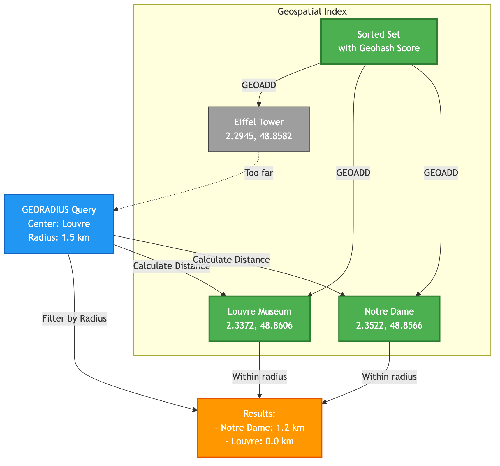

# Chapter 4: Geospatial Indexing

SpinelDB includes a powerful set of commands for storing, querying, and analyzing geospatial data. This functionality is built on top of the Sorted Set data type, using a clever technique called [Geohashing](https://en.wikipedia.org/wiki/Geohash) to encode two-dimensional longitude and latitude coordinates into a one-dimensional score.

This allows you to perform complex radius queries and distance calculations with incredible speed, making it ideal for applications like:
*   Finding nearby points of interest ("restaurants near me").
*   Tracking real-time locations of vehicles or users.
*   Geofencing and location-based alerts.

### Geospatial Query Flow



---

## 1. Adding Geospatial Items (`GEOADD`)

The first step is to add items to a geospatial index. You provide a key, and then one or more triplets of longitude, latitude, and member name.

**Command:** `GEOADD`

### Example Session

Let's create a geospatial index for a few famous landmarks in Paris.

```shell
# Add landmarks to a key named 'paris:landmarks'.
# The command returns the number of new items added.
127.0.0.1:7878> GEOADD paris:landmarks 2.2945 48.8582 "Eiffel Tower" 2.3372 48.8606 "Louvre Museum" 2.3522 48.8566 "Notre Dame"
(integer) 3
```
**Important:** The order is always **longitude first, then latitude**. This is a standard convention in geospatial commands.

---

## 2. Retrieving Coordinates (`GEOPOS`)

Once items are added, you can retrieve their stored longitude and latitude at any time.

**Command:** `GEOPOS`

### Example Session

Let's find the coordinates of the Eiffel Tower.

```shell
# Request the position of one or more members
127.0.0.1:7878> GEOPOS paris:landmarks "Eiffel Tower" "Imaginary Place"
1) "2.2944999516010284"
   2) "48.85819912101994"
2) (nil)
```
The command returns an array of positions. If a member does not exist in the index, its position is returned as `(nil)`. The coordinates may have a slight precision difference from the input due to the nature of Geohash encoding, but this is perfectly normal and accurate enough for virtually all applications.

---

## 3. Retrieving Geohash Strings (`GEOHASH`)

You can retrieve the 11-character Geohash string representation for one or more members of a geospatial index. This can be useful for debugging, integration with other geohash-based systems, or for displaying a compact location identifier.

**Command:** `GEOHASH`

### Example Session

Let's get the Geohash strings for the Eiffel Tower and Notre Dame.

```shell
127.0.0.1:7878> GEOHASH paris:landmarks "Eiffel Tower" "Notre Dame" "NonExistent"
1) "u0000000000" # Example Geohash, actual value will vary
2) "u0000000000" # Example Geohash, actual value will vary
3) (nil)
```
The command returns an array of Geohash strings. If a member does not exist, `(nil)` is returned for that member.

---

## 4. Calculating Distance (`GEODIST`)

SpinelDB can calculate the direct ("as the crow flies") distance between any two members in a geospatial index.

**Command:** `GEODIST`

### Example Session

Let's find the distance between the Louvre Museum and Notre Dame.

```shell
# Calculate the distance in meters (the default unit)
127.0.0.1:7878> GEODIST paris:landmarks "Louvre Museum" "Notre Dame"
"1205.2891"

# You can also specify other units: m, km, ft, mi
127.0.0.1:7878> GEODIST paris:landmarks "Louvre Museum" "Notre Dame" km
"1.2053"
```

---

## 5. Querying by Radius (`GEORADIUS` and `GEORADIUSBYMEMBER`)

This is the most powerful feature of the geospatial toolset. You can query for all members within a given radius from a central point. This point can be specified either by coordinates (`GEORADIUS`) or by another member in the set (`GEORADIUSBYMEMBER`).

**Commands:** `GEORADIUS`, `GEORADIUSBYMEMBER`

### Example Session

Let's find all landmarks within a 1.5-kilometer radius of the Louvre.

```shell
# First, let's use GEORADIUSBYMEMBER, which is often more convenient.
127.0.0.1:7878> GEORADIUSBYMEMBER paris:landmarks "Louvre Museum" 1.5 km
1) "Notre Dame"
2) "Louvre Museum"

# We can also add options to get more information.
# WITHDIST: Shows the distance of each item from the center.
# WITHCOORD: Shows the coordinates of each item.
127.0.0.1:7878> GEORADIUSBYMEMBER paris:landmarks "Louvre Museum" 1.5 km WITHDIST WITHCOORD
1) 1) "Notre Dame"
   2) "1.2053"
   3) 1) "2.3522000551223755"
      2) "48.8565999216447"
2) 1) "Louvre Museum"
   2) "0.0000"
   3) 1) "2.3371998965740204"
      2) "48.86060133596796"

# You can also sort the results by distance (ASC is default) and limit the count.
# Let's find the closest landmark to the Eiffel Tower.
127.0.0.1:7878> GEORADIUSBYMEMBER paris:landmarks "Eiffel Tower" 5 km COUNT 1
1) "Eiffel Tower" 
# The closest point is always the center point itself! Let's get the *next* closest.
127.0.0.1:7878> GEORADIUSBYMEMBER paris:landmarks "Eiffel Tower" 5 km COUNT 2
1) "Eiffel Tower"
2) "Louvre Museum"
```

The `GEORADIUS` command works identically, but you provide longitude and latitude instead of a member name as the center point.

---

<div className="doc-nav-links">
  <span>⬅️ <strong>Previous Chapter: <a href="./native-json">3. Working with JSON Documents</a></strong></span>
  <span>➡️ <strong>Next Chapter: <a href="./caching">5. Intelligent Caching</a></strong></span>
</div>
