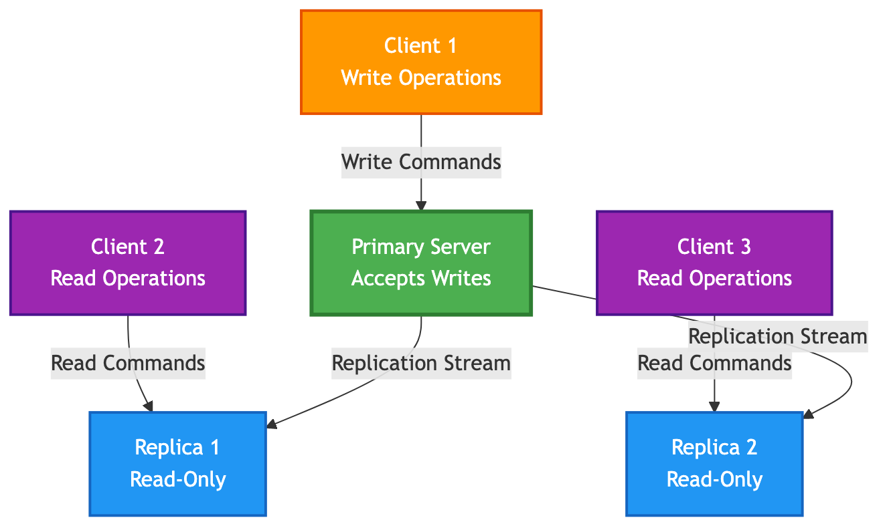
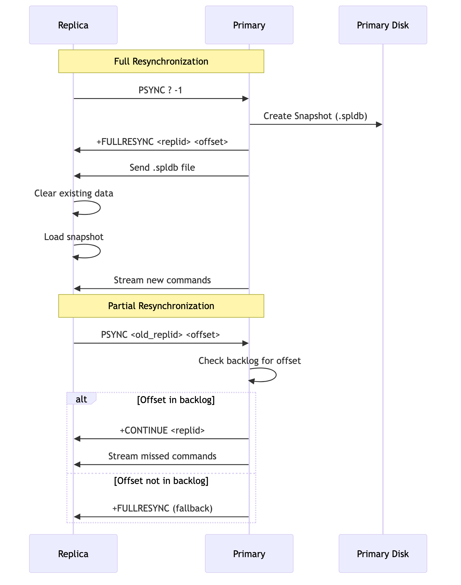

# Chapter 5: Primary-Replica Replication

Running a single instance of SpinelDB is great for development, but for production environments, you need redundancy and the ability to scale. SpinelDB supports a standard **primary-replica** (formerly master-slave) replication model, which provides a simple yet powerful way to achieve high availability and scale read operations.

### How It Works

In this model, you have one **primary** instance and one or more **replica** instances.
*   **Primary:** This is the main, authoritative instance. It accepts all write commands from clients.
*   **Replica:** A replica is an exact, real-time copy of the primary. It connects to the primary and receives a continuous stream of the write commands that are executed on it.

### Key Benefits

1.  **High Availability & Data Redundancy:** If the primary instance fails, a replica can be manually or automatically promoted to become the new primary, minimizing downtime and preventing data loss.
2.  **Read Scaling:** Read-heavy workloads can be distributed across multiple replicas. This offloads traffic from the primary, allowing it to focus on handling writes.

### Primary-Replica Architecture



---

## 1. Configuring a Primary

Configuring a node as a primary is the default behavior. The main setting is in the `[replication]` section of your `config.toml` file.

```toml
# In the primary's config.toml

[replication]
role = "primary"

# [Optional] Data Safety Configuration
# You can configure the primary to reject writes if it doesn't have a minimum
# number of healthy replicas connected. This prevents data loss in a network partition.
#
# Reject writes if there are fewer than 1 replica connected.
min_replicas_to_write = 1
#
# A replica is considered "healthy" if its last acknowledgment was received
# within this many seconds.
min_replicas_max_lag = 10
```
Simply start the server with this configuration, and it will act as a primary, ready to accept connections from replicas.

---

## 2. Configuring a Replica

To configure a node as a replica, you need to tell it the address of the primary it should connect to.

```toml
# In the replica's config.toml

[replication]
role = "replica"
primary_host = "192.168.1.10" # IP address of the primary server
primary_port = 7878          # Port of the primary server
# tls_enabled = false        # Set to true if the primary requires TLS
```

When you start this instance, it will **not** accept write commands from clients. Instead, it will automatically attempt to connect to the primary at the specified address and begin the synchronization process.

---

## 3. The Synchronization Process

When a replica first connects to a primary, it needs to get a full copy of the dataset. This process is called **synchronization**. SpinelDB uses a Redis-compatible protocol (`PSYNC`) and supports two types of syncs:

### Full Resynchronization

This happens when a replica connects for the first time, or after it has been disconnected for too long.
1.  The replica sends a `PSYNC` request to the primary.
2.  The primary recognizes it's a new replica and starts a background save, creating a snapshot of its entire dataset in the `.spldb` file format.
3.  The primary sends this `.spldb` file over the network to the replica.
4.  The replica receives the file, **clears all its existing data**, and loads the snapshot into memory.
5.  Once the snapshot is loaded, the primary starts streaming all new write commands that have occurred since the snapshot was started.

This process is robust but can be resource-intensive for large datasets.

### Partial Resynchronization

To avoid the cost of a full resync for brief disconnections (like a network hiccup or a quick restart), the primary maintains a special in-memory circular buffer called the **replication backlog**. This backlog stores the most recent stream of write commands.

1.  A replica that was previously connected disconnects.
2.  It reconnects shortly after and sends a `PSYNC` request, telling the primary its old **replication ID** and the **offset** (the last command it processed).
3.  The primary checks if the requested offset is still available in its backlog.
4.  If it is, the primary sends a `+CONTINUE` response and streams only the missed commands from the backlog to the replica.
5.  The replica applies these commands and is quickly back in sync.

This process is extremely fast and efficient, making the replication system resilient to transient network issues. If the replica is disconnected for too long and the required offset is no longer in the backlog, the primary will force a full resynchronization.

### Synchronization Process Flow



---

## 4. Verifying Replication Status

You can check the status of replication on both the primary and replica nodes using the `INFO replication` command.

**On the Primary:**

```shell
127.0.0.1:7878> INFO replication
# Replication
role:master
master_replid:a1b2c3d4...
master_repl_offset:12345
connected_slaves:1
slave0:ip=192.168.1.11,port=7878,state=online,offset=12345,lag=0
```
This shows you the primary's own replication ID and offset, and a list of all connected replicas and their status.

**On a Replica:**

```shell
192.168.1.11:7878> INFO replication
# Replication
role:slave
master_host:192.168.1.10
master_port:7878
master_link_status:up
master_last_io_seconds_ago:1
master_sync_in_progress:0
slave_repl_offset:12345
```
This confirms that the node is a replica and shows its connection status to the primary and how up-to-date it is.

---

<div style="display: flex; justify-content: space-between;">
  <span>⬅️ <strong>Previous Chapter: <a href="./05-caching.md">5. Intelligent Caching</a></strong></span>
  <span>➡️ <strong>Next Chapter: <a href="./07-clustering.md">7. Cluster Mode</a></strong></span>
</div>
