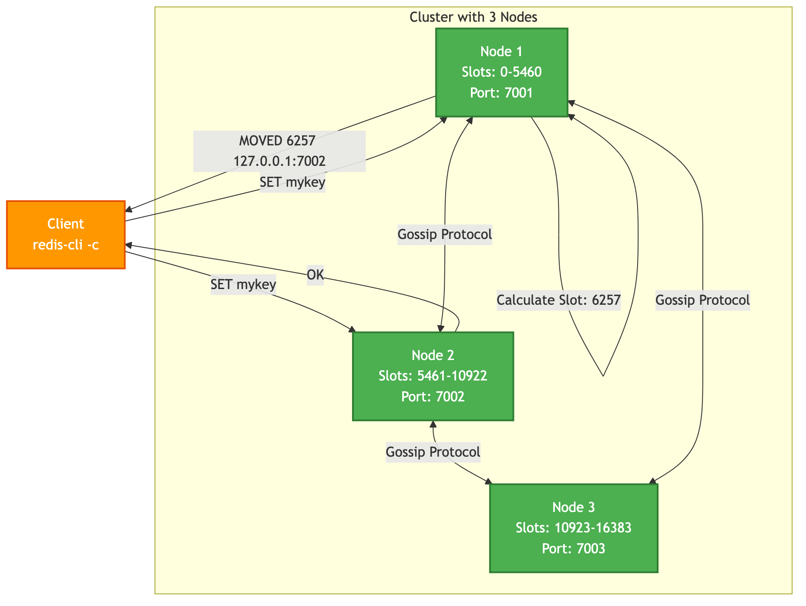

# Chapter 6: Cluster Mode

While primary-replica replication is excellent for high availability and read scaling, it has a limitation: the entire dataset must still fit in the memory of a single primary machine. To scale beyond the capacity of one server and to distribute the write load, SpinelDB offers **Cluster Mode**.

SpinelDB Cluster allows you to automatically **shard** your data across multiple nodes. This means different parts of your keyspace are stored on different servers, enabling horizontal scaling for both memory capacity and throughput.

### Key Concepts

*   **Hash Slots:** The entire keyspace is divided into **16,384** hash slots. Every key is mapped to one of these slots using a CRC16 algorithm. This mapping is deterministic and stable.
*   **Sharding:** Each primary node in the cluster is responsible for a subset of these hash slots. For example, in a 3-node cluster, Node A might hold slots 0-5460, Node B holds 5461-10922, and Node C holds 10923-16383.
*   **Gossip Protocol:** Cluster nodes don't rely on a central configuration server. Instead, they communicate with each other directly using a **gossip protocol**. They constantly exchange information about which nodes are online and which slots each node is responsible for. This makes the cluster resilient and self-organizing.
*   **Client Redirection:** When a client connects to a node and issues a command for a key that belongs to a different node, the server doesn't execute it. Instead, it replies with a `MOVED` or `ASK` redirection error, telling the client the correct address of the node that owns that key's slot. Smart clients cache this slot map and will send subsequent commands for that slot directly to the correct node.

### Cluster Architecture



---

## 1. Configuring a Cluster Node

Enabling cluster mode requires a few key settings in `config.toml`. Each node in the cluster must have a similar configuration.

```toml
# In each node's config.toml

# The main server port
port = 7001

[cluster]
# Enable cluster mode
enabled = true
# The file where this node's cluster configuration is stored.
# This file is managed by SpinelDB and should not be edited manually.
config_file = "nodes-7001.conf"
# The time in milliseconds a node can be unreachable before being marked as potentially failed.
node_timeout = 15000
# The number of other masters that must be reachable for this master to remain writable.
# This is the primary defense against split-brain. For N masters, set this to (N/2) + 1.
failover_quorum = 2
```

**Important:** Each node in the cluster must have its own unique `config_file` and run on a unique port combination (server port and cluster bus port). The cluster bus port is automatically calculated as `port + 10000` by default.

---

## 2. Creating the Cluster

After starting all your SpinelDB instances with `cluster.enabled = true`, they will be running in isolation. You need to explicitly tell them to form a cluster. This is typically done with an external tool or a series of `CLUSTER MEET` commands.

Let's assume you have three nodes running on `127.0.0.1` at ports `7001`, `7002`, and `7003`.

1.  **Connect to the first node:**
    ```shell
    redis-cli -p 7001
    ```

2.  **Tell it to meet the other nodes:**
    The `CLUSTER MEET` command instructs a node to start a handshake with another node, initiating the gossip protocol.

    ```shell
    127.0.0.1:7001> CLUSTER MEET 127.0.0.1 7002
    OK
    127.0.0.1:7001> CLUSTER MEET 127.0.0.1 7003
    OK
    ```
    Once a node meets another, they will exchange information about all the other nodes they know. You don't need to connect every node to every other node; a few connections are enough for the cluster to converge.

3.  **Assign Hash Slots:**
    At this point, all nodes are aware of each other, but none of them are responsible for any data yet. You must manually assign all 16,384 slots to the primary nodes.

    ```shell
    # Assign slots 0-5460 to node on port 7001
    redis-cli -p 7001 CLUSTER ADDSLOTS {0..5460}

    # Assign slots 5461-10922 to node on port 7002
    redis-cli -p 7002 CLUSTER ADDSLOTS {5461..10922}

    # Assign slots 10923-16383 to node on port 7003
    redis-cli -p 7003 CLUSTER ADDSLOTS {10923..16383}
    ```
    *(Note: The `{start..end}` syntax is a feature of some shells like bash/zsh. You may need to generate the numbers with a script if your shell doesn't support it.)*

Your cluster is now operational!

---

## 3. Interacting with the Cluster

When using a cluster-aware client (like `redis-cli` started with the `-c` flag), redirection is handled automatically.

```shell
# Start redis-cli in cluster mode
redis-cli -c -p 7001

# Set a key. The client calculates the slot and sends the command to the correct node.
127.0.0.1:7001> SET mykey "hello"
-> Redirected to slot [6257] located at 127.0.0.1:7002
OK

# The prompt now shows you are connected to the node that owns the slot for 'mykey'.
127.0.0.1:7002> GET mykey
"hello"

# Set a key with a hash tag to force it into the same slot as 'mykey'
127.0.0.1:7002> SET another{mykey} "world"
OK
```

### Hash Tags

A **hash tag** is a substring within a key that is enclosed in `{...}`. When a key has a hash tag, the cluster uses *only* the part inside the braces to calculate the hash slot. This allows you to guarantee that multiple keys are stored on the same node, which is necessary for multi-key operations (e.g., `SINTER`, transactions) that are not allowed to cross slots.

*   `user:{1000}:profile` and `user:{1000}:orders` will map to the same slot.
*   `product:1` and `product:2` will likely map to different slots.

---

<div style="display: flex; justify-content: space-between;">
  <span>⬅️ <strong>Previous Chapter: <a href="./06-replication.md">6. Primary-Replica Replication</a></strong></span>
  <span>➡️ <strong>Next Chapter: <a href="./08-warden-failover.md">8. Automatic Failover with Warden</a></strong></span>
</div>
