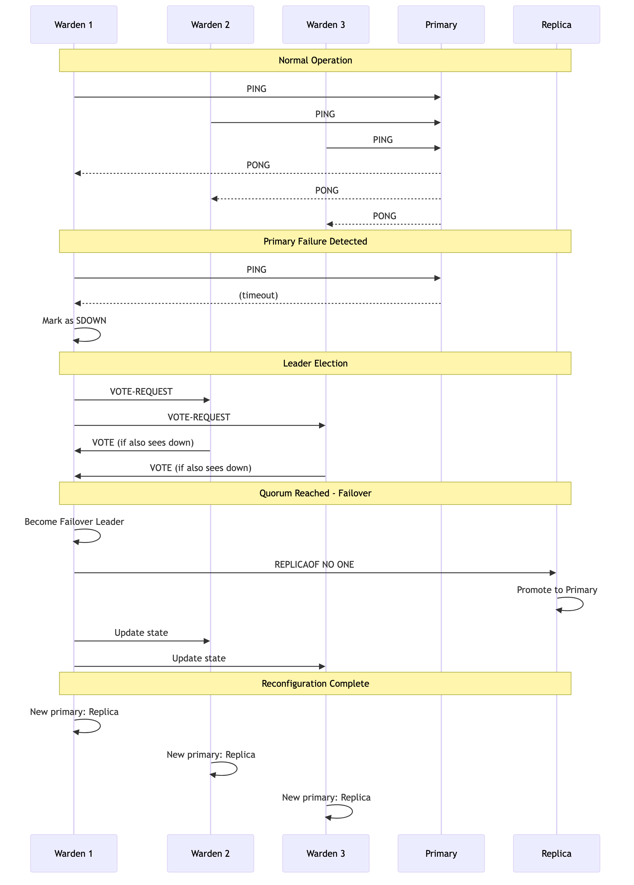

# Chapter 8: Automatic Failover with Warden

While SpinelDB Cluster provides a foundation for high availability, its built-in, replica-initiated failover mechanism has limitations, particularly concerning **split-brain** scenarios during network partitions. For production deployments, a more robust solution is required.

Enter **SpinelDB Warden**.

Warden is a separate, lightweight process that acts as a **sentinel** or external coordinator for your SpinelDB instances. You run a small number of Warden processes (typically 3 or 5 for a quorum) alongside your database nodes. These Wardens monitor your primary and replica instances, communicate with each other, and manage the failover process.

### Why Use Warden?

1.  **Quorum-Based Decisions:** A failover is only triggered when a **quorum** (a majority) of Warden instances agree that a primary is down. This prevents a single, network-isolated Warden from incorrectly initiating a failover.
2.  **Split-Brain Prevention:** Because decisions are made by an external majority, Warden provides strong protection against split-brain scenarios where a partitioned primary might otherwise continue accepting writes.
3.  **Reliable Master Discovery:** Warden provides a stable endpoint for your application clients. Instead of connecting directly to the database, clients query a Warden to ask, "Who is the current primary for master group `X`?". Warden always provides the correct, up-to-date address, even after a failover.

> **Production Recommendation:** For any production setup requiring high availability, using Warden for failover management is **strongly recommended** over the built-in cluster failover.

---

## 1. Warden Configuration

Warden runs using its own configuration file, typically named `warden.toml`. It does not use the main `config.toml`.

### Example `warden.toml`

Here is an example configuration for a Warden monitoring a primary-replica group named `mymaster`.

```toml
# The address and port for this Warden instance to listen on for client queries.
host = "0.0.0.0"
port = 26379

# The address this Warden should announce to its peers.
# Useful if running in a containerized environment like Docker or Kubernetes.
# announce_ip = "10.0.1.5"

# Define each primary group you want to monitor.
# 'masters' is an array table.
[[masters]]
# A unique name for this primary-replica group.
name = "mymaster"

# The initial address of the primary server.
ip = "192.168.1.10"
port = 7878

# The number of Wardens that must agree a master is down before starting a failover.
# For N Wardens, this should be (N/2) + 1.
quorum = 2

# The time after which a non-responding instance is considered down.
down_after = "30s"

# The maximum time a failover can take.
failover_timeout = "3m"

# How often this Warden will publish "hello" messages to other Wardens.
hello_interval = "2s"
```

You would create a similar `warden.toml` file on each machine where you intend to run a Warden process.

---

## 2. Running Warden

To start SpinelDB in Warden mode, you use the `--warden` command-line flag, followed by the path to your `warden.toml` file.

```bash
# Start the binary in Warden mode
./target/release/spineldb --warden /path/to/warden.toml
```

You should run at least **three** Warden instances on different machines for a fault-tolerant setup. They will discover each other automatically by subscribing to a special `__warden__:hello` channel on the SpinelDB primary they are monitoring.

---

## 3. The Failover Process in Action

Here’s a step-by-step look at what happens when a primary fails:

1.  **Monitoring:** Each Warden instance independently sends `PING` and `INFO` commands to the `mymaster` primary and all its known replicas.
2.  **Subjective Down (SDOWN):** One Warden fails to get a response from the primary within the `down_after` period. It internally marks the primary as **SDOWN**.
3.  **Leader Election:** The Warden that detected the failure starts a leader election by sending a `VOTE-REQUEST` to all other Wardens monitoring `mymaster`.
4.  **Voting:** Other Wardens, if they also see the master as down and haven't voted in a more recent election, will cast a vote for the requesting Warden.
5.  **Quorum & Leadership:** Once a Warden receives votes from a `quorum` of its peers, it becomes the **failover leader**.
6.  **Replica Selection:** The leader analyzes the last known state of all replicas and selects the best one to promote (based on replication offset).
7.  **Promotion:** The leader sends a `REPLICAOF NO ONE` command to the chosen replica, promoting it to a primary.
8.  **Reconfiguration:** The leader then sends `REPLICAOF <new_master_ip> <new_master_port>` commands to all other replicas (and the old, failed primary if it becomes reachable again) to ensure they follow the new primary.
9.  **State Update:** All Wardens update their internal state to reflect the new primary address for `mymaster`.

The entire process is automated and typically completes within seconds.

### Failover Process Flow



---

<div className="doc-nav-links">
  <span>⬅️ <strong>Previous Chapter: <a href="./clustering">7. Cluster Mode</a></strong></span>
  <span>➡️ <strong>Next Chapter: <a href="./security-acl">9. Security with Access Control Lists (ACL)</a></strong></span>
</div>
