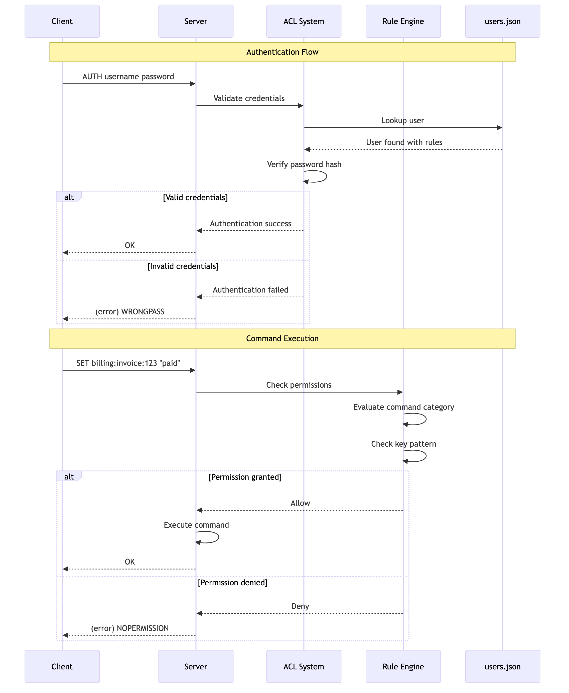

# Chapter 8: Security with Access Control Lists (ACL)

While a simple password (`requirepass`) offers a basic layer of security, modern, multi-tenant environments often require more granular control over what different clients can do. SpinelDB provides a powerful and flexible **Access Control List (ACL)** system, compatible with Redis 6+, to solve this problem.

With ACLs, you can define specific **rules** that grant or deny permissions for:
*   Specific commands (e.g., allow `GET`, deny `DEL`).
*   Command categories (e.g., allow all read commands `@read`, deny dangerous commands `@dangerous`).
*   Specific key patterns (e.g., allow access only to keys starting with `user:123:*`).
*   Pub/Sub channel patterns.

These rules are then assigned to different **users**, each with their own password.

### ACL Authentication and Authorization Flow



---

## 1. Enabling and Configuring ACLs

ACLs are configured in your `config.toml` file. You define a set of named rules and can also pre-load users.

### Example `config.toml` ACL Configuration

```toml
# In your config.toml

# The path to a separate file for storing user definitions.
# This keeps user credentials out of your main config.
acl_file = "users.json"

[acl]
# Enable the ACL system. When true, the legacy 'password' directive is ignored.
enabled = true

# Define a set of reusable, named rules.
# 'rules' is an array table.

[[acl.rules]]
name = "readonly-user"
# Allow all commands in the @read category.
# Deny the dangerous FLUSHALL command explicitly.
commands = ["+@read", "-FLUSHALL"]
# Allow access to any key.
keys = ["allkeys"]
# Allow subscribing to any channel.
pubsub_channels = ["allchannels"]

[[acl.rules]]
name = "app-worker"
# Allow all commands (+@all)
# But deny administrative and dangerous commands (-@admin, -@dangerous)
commands = ["+@all", "-@admin", "-@dangerous"]
# This worker can only access keys prefixed with "app:queue:"
keys = ["~app:queue:*"]
# It can publish to any channel but cannot subscribe.
pubsub_channels = ["allchannels"] # This only grants publish rights for non-pubsub commands.

[[acl.rules]]
name = "billing-service"
# This service can read anything, but can only write to billing keys.
commands = ["+@read", "+@write"]
keys = ["~billing:*"]
```

### The `users.json` File

User definitions, including their password hashes, are stored in a separate JSON file specified by `acl_file`. This is crucial for security and allows you to manage users without restarting the server.

**Example `users.json`:**

```json
{
  "users": [
    {
      "username": "default",
      "password_hash": "$argon2id$v=19$m=16,t=2,p=1$c29tZXNhbHQ$...",
      "rules": ["readonly-user"]
    },
    {
      "username": "worker-01",
      "password_hash": "$argon2id$v=19$m=16,t=2,p=1$YW5vdGhlcnNhbHQ$...",
      "rules": ["app-worker"]
    }
  ]
}
```
**Note:** The `password_hash` is an Argon2 hash. You don't create this manually; SpinelDB's `ACL SETUSER` command will generate it for you.

---

## 2. Managing Users Dynamically

You can manage users and their permissions at runtime without restarting the server, using the `ACL` command.

**Commands:** `ACL SETUSER`, `ACL GETUSER`, `ACL DELUSER`, `ACL LIST`, `ACL SAVE`

### Example `ACL` Session

Let's create a new user for our billing service and save the changes.

```shell
# First, connect as an admin user with permission to run ACL commands.

# Create or update a user. The format is 'ACL SETUSER <username> [rules...]'.
# The '>password' rule sets a new password and hashes it automatically.
# The '+billing-service' rule assigns the 'billing-service' rule set we defined in config.toml.
127.0.0.1:7878> ACL SETUSER billing-user >supersecretpassword +billing-service on
OK

# View the configuration for the new user
127.0.0.1:7878> ACL GETUSER billing-user
1) "rules"
2) "+billing-service on"

# List all configured users
127.0.0.1:7878> ACL LIST
1) "user default on +readonly-user"
2) "user worker-01 on +app-worker"
3) "user billing-user on +billing-service"

# IMPORTANT: Persist the new user to the users.json file
127.0.0.1:7878> ACL SAVE
OK
```

If you don't run `ACL SAVE`, any users you create with `ACL SETUSER` will be lost when the server restarts.

---

## 3. Client Authentication

With ACLs enabled, clients must authenticate using the `AUTH` command with their username and password. The legacy single-password `AUTH` is no longer used.

**Command:** `AUTH <username> <password>`

### Example Client Session

A client connecting as the `billing-user` we just created:

```shell
# Connect to the server
redis-cli -p 7878

# Attempting a command before authenticating will fail
127.0.0.1:7878> PING
(error) NOPERmission command not allowed

# Authenticate with username and password
127.0.0.1:7878> AUTH billing-user supersecretpassword
OK

# Now we can run commands permitted by the 'billing-service' rule.
# Writing to a billing key is allowed.
127.0.0.1:7878> SET billing:invoice:456 "paid"
OK

# But writing to a non-billing key is denied.
127.0.0.1:7878> SET user:profile:1 "test"
(error) NOPERmission command not allowed
```

---

### A Robust Security Model

SpinelDB's ACL system provides a comprehensive and flexible security model that is essential for production environments. By defining fine-grained rules and assigning them to different users, you can enforce the principle of least privilege and ensure that clients can only access the data and commands they are explicitly authorized for.

➡️ **Next Chapter: [9. Server-Side Scripting with Lua](./09-lua-scripting.md)**
