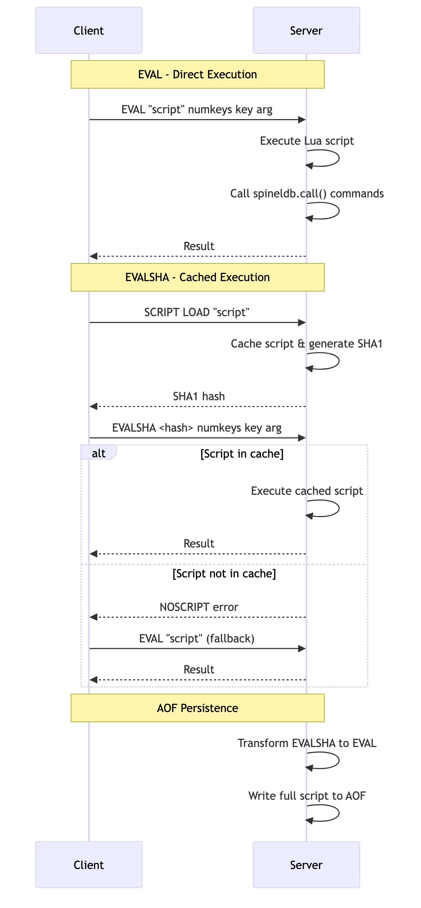

# Chapter 9: Server-Side Scripting with Lua

While SpinelDB offers a rich set of commands, sometimes you need to perform a sequence of operations atomically without the overhead of a `MULTI`/`EXEC` transaction or multiple network round-trips. SpinelDB, like Redis, solves this with **server-side Lua scripting**.

You can send a Lua script to the server, which will execute it in a sandboxed environment. From within the script, you have access to a special API to call SpinelDB commands. The entire script runs as a single, atomic operation—no other command will be executed while your script is running.

### Key Benefits

*   **Atomicity:** The script is guaranteed to execute without interruption.
*   **Performance:** Reduces network latency by combining multiple operations into a single round-trip.
*   **Data Locality:** Logic is executed where the data lives, avoiding the need to transfer intermediate data back and forth to the client.

### Lua Scripting Flow



---

## 1. Executing Scripts with `EVAL`

The `EVAL` command is the primary way to execute a Lua script.

**Command:** `EVAL <script> <numkeys> [key ...] [arg ...]`

*   `<script>`: The Lua script as a string.
*   `<numkeys>`: The number of arguments that follow which should be treated as **key names**. This is crucial for SpinelDB Cluster to ensure all keys in a script are located in the same hash slot.
*   `[key ...]` An optional list of key names, accessible in Lua via the global `KEYS` table.
*   `[arg ...]` An optional list of additional arguments, accessible in Lua via the global `ARGV` table.

### Example: Atomic GET-and-SET

Let's write a script that gets the value of a key and, if it matches an expected value, sets it to a new value. This is an atomic compare-and-swap operation.

```lua
-- Lua Script
-- KEYS[1] is the key to operate on
-- ARGV[1] is the expected old value
-- ARGV[2] is the new value

local current_val = spineldb.call('GET', KEYS[1])
if current_val == ARGV[1] then
  spineldb.call('SET', KEYS[1], ARGV[2])
  return 1 -- Return 1 for success
else
  return 0 -- Return 0 for failure
end
```

Now, let's execute this script using `redis-cli`:

```shell
# First, set an initial value
127.0.0.1:7878> SET mykey "old-value"
OK

# Execute the script.
# Script: The lua code as a single string
# numkeys: 1 (we are passing one key, "mykey")
# key: mykey
# arg: old-value
# arg: new-value
127.0.0.1:7878> EVAL "local current_val = spineldb.call('GET', KEYS[1]) if current_val == ARGV[1] then spineldb.call('SET', KEYS[1], ARGV[2]) return 1 else return 0 end" 1 mykey "old-value" "new-value"
(integer) 1

# Check the new value
127.0.0.1:7878> GET mykey
"new-value"

# Try running it again with the wrong "old-value"
127.0.0.1:7878> EVAL "local current_val = spineldb.call('GET', KEYS[1]) if current_val == ARGV[1] then spineldb.call('SET', KEYS[1], ARGV[2]) return 1 else return 0 end" 1 mykey "wrong-old-value" "another-value"
(integer) 0
```
The key's value was not changed the second time because the condition failed. The entire operation was atomic.

---

## 2. Calling SpinelDB Commands from Lua

Inside a Lua script, you cannot execute arbitrary system commands. You interact with the database through the `spineldb` global table.

*   `spineldb.call(command, key, ...)`: Executes a SpinelDB command. If the command results in an error, the entire script will stop and return that error to the client.
*   `spineldb.pcall(command, key, ...)`: A "protected" call. It executes a command but will not stop the script if it fails. Instead, it returns a Lua table containing an `err` key with the error message. This allows you to handle errors gracefully within your script.

---

## 3. Caching Scripts with `SCRIPT LOAD` and `EVALSHA`

Sending the same large script to the server repeatedly is inefficient. SpinelDB allows you to cache scripts on the server and execute them later using their unique SHA1 hash.

**Commands:** `SCRIPT LOAD`, `EVALSHA`

### Workflow

1.  **Load the Script:** Use `SCRIPT LOAD` to send the script to the server once. SpinelDB will cache it and return its SHA1 hash.
2.  **Execute by Hash:** Use `EVALSHA` with the returned hash to execute the cached script. This is much faster as you are only sending the small hash over the network.

### Example Session

Let's cache and run our compare-and-swap script.

```shell
# Step 1: Load the script into the server's cache
127.0.0.1:7878> SCRIPT LOAD "local current_val = spineldb.call('GET', KEYS[1]) if current_val == ARGV[1] then spineldb.call('SET', KEYS[1], ARGV[2]) return 1 else return 0 end"
"b3c2e36d40...<rest_of_hash>"  # The server returns the SHA1 hash

# Step 2: Set an initial value
127.0.0.1:7878> SET anotherkey "initial"
OK

# Step 3: Execute the script using its hash
# The arguments are the same as EVAL, just replacing the script with the SHA1 hash.
127.0.0.1:7878> EVALSHA b3c2e36d40...<rest_of_hash> 1 anotherkey "initial" "updated"
(integer) 1

# Verify the result
127.0.0.1:7878> GET anotherkey
"updated"
```

Your application should first try `EVALSHA`. If the server returns a `NOSCRIPT` error (meaning the script isn't in the cache, perhaps due to a server restart), your client should then fall back to using `EVAL` once to re-load and execute the script. Most client libraries handle this logic for you.

---

### Persisting Scripts for Durability

When you use `SCRIPT LOAD` or `EVALSHA`, SpinelDB ensures that these scripts are also persisted to the Append-Only File (AOF) for durability. To guarantee that the AOF remains self-contained and can be replayed correctly even after a server restart or on a replica, SpinelDB transforms `EVALSHA` commands into `EVAL` commands that include the full script body. This means you don't have to worry about scripts being missing when recovering from an AOF or during replication; the AOF will always contain the necessary script content to rebuild the state.

---

<div style="display: flex; justify-content: space-between;">
  <span>⬅️ <strong>Previous Chapter: <a href="./09-security-acl.md">9. Security with Access Control Lists (ACL)</a></strong></span>
  <span>➡️ <strong>Next Chapter: <a href="./11-transactions.md">11. Atomic Operations with Transactions</a></strong></span>
</div>
