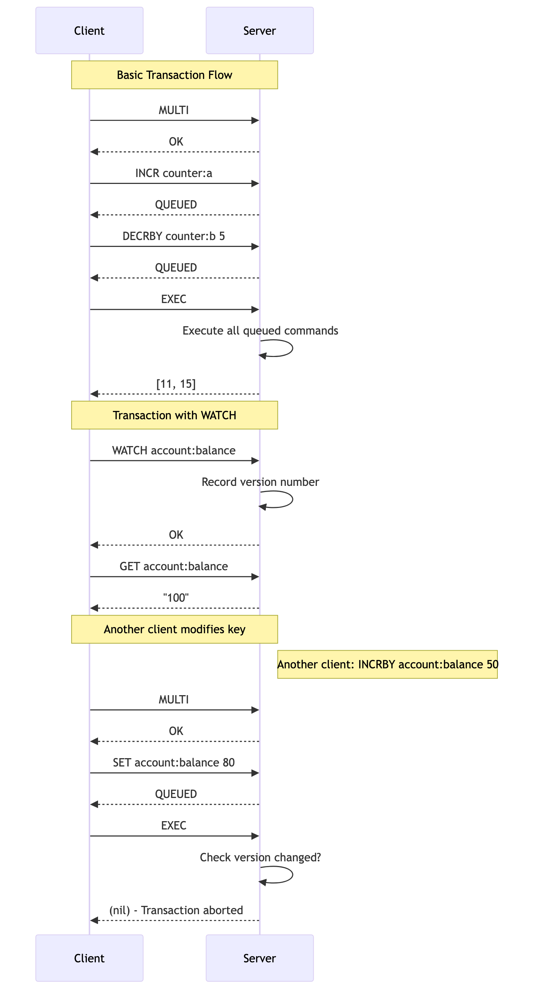

# Chapter 10: Atomic Operations with Transactions

While Lua scripts are excellent for creating new atomic operations, sometimes you need to run a sequence of existing commands as a single, atomic transaction. SpinelDB supports this with the `MULTI`, `EXEC`, `DISCARD`, and `WATCH` commands, providing a mechanism for **optimistic locking**.

A transaction guarantees that either **all** of the commands in the sequence are executed, or **none** of them are. The commands are executed sequentially without interruption from other clients.

### Transaction Flow



---

## 1. Basic Transactions with `MULTI` and `EXEC`

The core of a transaction is the `MULTI`/`EXEC` block.

1.  **`MULTI`:** Starts a transaction block. All subsequent commands from the client are not executed immediately but are instead **queued**.
2.  **`EXEC`:** Executes all the commands that have been queued since the `MULTI` command was issued. The response is an array containing the reply for each command in the order they were queued.

**Commands:** `MULTI`, `EXEC`, `DISCARD`

### Example Session

Let's use a transaction to atomically increment two separate counters.

```shell
# Set initial values
127.0.0.1:7878> SET counter:a 10
OK
127.0.0.1:7878> SET counter:b 20
OK

# Start the transaction block. The server replies with OK.
127.0.0.1:7878> MULTI
OK

# Queue the first command. The server replies with QUEUED.
127.0.0.1:7878> INCR counter:a
QUEUED

# Queue the second command.
127.0.0.1:7878> DECRBY counter:b 5
QUEUED

# Execute the transaction.
127.0.0.1:7878> EXEC
1) (integer) 11
2) (integer) 15
```
The server's reply to `EXEC` is an array where the first element is the result of `INCR counter:a` and the second is the result of `DECRBY counter:b 5`. We can be certain that no other client could have modified these counters between our `INCR` and `DECRBY` operations.

If you decide to cancel the transaction before running `EXEC`, you can use the `DISCARD` command.

```shell
127.0.0.1:7878> MULTI
OK
127.0.0.1:7878> INCR counter:a
QUEUED
127.0.0.1:7878> DISCARD
OK

# The INCR was not executed.
127.0.0.1:7878> GET counter:a
"11"
```

---

## 2. Optimistic Locking with `WATCH`

What happens if another client modifies a key *after* you've started thinking about your transaction, but *before* you've called `MULTI`? This could lead to a race condition where your transaction operates on stale data.

The `WATCH` command solves this problem by providing **check-and-set (CAS)** capabilities, also known as optimistic locking. SpinelDB achieves this by internally tracking a version number for each key. When you `WATCH` a key, SpinelDB records its current version. If this version changes before your `EXEC` command, the transaction is aborted.

**Workflow:**
1.  **`WATCH key ...`:** You tell SpinelDB which keys you intend to modify in your transaction. SpinelDB starts monitoring these keys for any changes by recording their internal version numbers.
2.  You read the values of the watched keys and perform your application logic.
3.  **`MULTI` / `EXEC`:** You start and execute your transaction.
4.  **Verification:** Just before executing your queued commands, SpinelDB checks if the version numbers of any keys you `WATCH`ed have changed. This indicates another client has modified them.
    *   If **no keys were modified**, the transaction executes normally.
    *   If **any key was modified**, the transaction is aborted, and `EXEC` returns a `(nil)` reply. Your application should then retry the entire process (watch, read, multi, exec).

### Example Session

Let's simulate a race condition.

**Client 1 (Our Application):**

```shell
# Set an initial balance
127.0.0.1:7878> SET account:balance 100
OK

# Watch the key we intend to modify
127.0.0.1:7878> WATCH account:balance
OK

# Read the current balance (application logic would do this)
127.0.0.1:7878> GET account:balance
"100"
```

**Client 2 (Another Process):**

At this exact moment, another client makes a deposit, modifying the key that Client 1 is watching.

```shell
127.0.0.1:7878> INCRBY account:balance 50
(integer) 150
```

**Client 1 (Continuing its Transaction):**

Client 1's application logic, based on the stale value of "100", decides to set the new balance to "80".

```shell
127.0.0.1:7878> MULTI
OK
127.0.0.1:7878> SET account:balance 80
QUEUED

# Try to execute the transaction
127.0.0.1:7878> EXEC
(nil)
```

The `EXEC` command returned `(nil)`! SpinelDB detected that `account:balance` was modified after `WATCH` was called, so it aborted the transaction to prevent the incorrect value ("80") from overwriting the correct new value ("150").

Client 1's application should now detect the `(nil)` reply and retry the entire operation, ensuring it reads the new, correct balance of 150.

---

<div style="display: flex; justify-content: space-between;">
  <span>⬅️ <strong>Previous Chapter: <a href="./10-lua-scripting.md">10. Server-Side Scripting with Lua</a></strong></span>
  <span>➡️ <strong>Next Chapter: <a href="./12-pubsub.md">12. Publish/Subscribe Messaging</a></strong></span>
</div>
