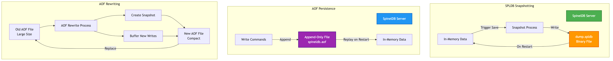

# Chapter 14: Persistence and Backup

While SpinelDB is an in-memory database, a key feature for any production system is **persistence**—the ability to save the in-memory dataset to durable storage on disk. This protects your data against process restarts, server reboots, and other unexpected shutdowns.

SpinelDB offers two primary modes of persistence, which can be used individually or together depending on your durability requirements.

### Persistence Flow



---

## 1. Snapshotting with SPLDB

Snapshotting is the default persistence method. It works by creating a point-in-time snapshot of your entire dataset and writing it to a single, compact binary file on disk (by default, `dump.spldb`). The SPLDB format includes a **checksum** to ensure data integrity upon loading. When saving, SpinelDB uses an **atomic write** process, writing to a temporary file first and then renaming it, which prevents data corruption in case of a crash during the save operation.

*   **Pros:** The `.spldb` file is a compact, single-file representation of your data at a specific moment, making it fast to load on startup and easy to back up.
*   **Cons:** If the server crashes between snapshots, all data written since the last successful save will be lost.

### Configuration

You can configure automatic snapshotting in `config.toml` with `save` rules.

```toml
# In your config.toml

[persistence]
spldb_enabled = true
spldb_path = "dump.spldb"

# Define one or more save rules.
# The server will trigger a save if ANY of these conditions are met.
save_rules = [
  # Save after 900 seconds (15 minutes) if at least 1 key has changed.
  { seconds = 900, changes = 1 },
  # Save after 300 seconds (5 minutes) if at least 10 keys have changed.
  { seconds = 300, changes = 10 },
  # Save after 60 seconds if at least 10,000 keys have changed.
  { seconds = 60, changes = 10000 },
]
```

### Manual Snapshots

You can also trigger a snapshot manually with the `SAVE` or `BGSAVE` commands.

*   **`SAVE`**: This is a **synchronous** operation. The server will block all other clients and will not respond until the entire dataset has been written to disk. It should only be used when you can tolerate a brief pause, such as during a maintenance window.
*   **`BGSAVE`**: This is an **asynchronous** operation. The server immediately forks a background process to handle the save. The main server process continues to serve requests without interruption. This is the recommended method for triggering manual saves in a production environment.

---

## 2. Append-Only File (AOF) Persistence

For higher durability, SpinelDB supports Append-Only File (AOF) persistence. Instead of saving snapshots, AOF logs **every single write command** received by the server to a file (e.g., `spineldb.aof`).

*   **Pros:** Offers much better durability. Depending on the `fsync` policy, you can limit data loss to, at most, one second of writes.
*   **Cons:** The AOF file can grow much larger than an equivalent SPLDB file over time. Replaying the AOF on startup can also be slower for very large files.

### Configuration

```toml
# In your config.toml

[persistence]
# Set spldb_enabled to false if you only want to use AOF.
spldb_enabled = false
aof_enabled = true
aof_path = "spineldb.aof"

# Controls how often data is physically written to disk.
# "everysec": fsync every second (good balance of performance and durability).
# "always": fsync after every write command (very durable, but slower).
# "no": Let the operating system decide when to fsync (fastest, least durable).
appendfsync = "everysec"
```

### AOF Rewriting

Because the AOF file is a log of all write operations, it can grow very large over time. To manage this, SpinelDB supports **AOF rewriting**. This process creates a new, minimal AOF file in the background that contains the smallest possible set of commands needed to rebuild the current dataset. This operation is **non-blocking**; the main server continues to serve requests. During the rewrite, any new write commands are buffered in memory and appended to the new AOF file once the snapshotting phase is complete. Crucially, for commands like `EVALSHA`, SpinelDB ensures the AOF is self-contained by transforming them into `EVAL` commands with the full script body, guaranteeing correct replay on restart.

Once complete, SpinelDB atomically replaces the old, bloated AOF file with the new, compact one.

SpinelDB can also be configured to trigger this process automatically when the file grows by a certain percentage.

```toml
# In your config.toml [persistence] section

# Trigger a rewrite when the AOF file size is 100% larger than the last rewrite.
auto_aof_rewrite_percentage = 100
# ...but only if the file size is at least 64mb.
auto_aof_rewrite_min_size = 67108864 # 64 * 1024 * 1024
```

---

## 3. Backups and Disaster Recovery

Your persistence files (`dump.spldb` and `spineldb.aof`) are critical for disaster recovery. You should have a regular process for backing them up to a separate location (e.g., another server, cloud storage like Amazon S3).

Because the SPLDB file is a consistent point-in-time snapshot, it is generally the easiest file to back up. You can simply copy the `dump.spldb` file to your backup location at regular intervals.

You can also create a backup manually on the server itself using the `BACKUP` command, which is a synchronous save to a specified path.

```shell
# This will block the server and save a snapshot to the specified file.
127.0.0.1:7878> BACKUP /mnt/backups/spineldb-backup-2023-10-27.spldb
OK
```

### Restoring from Backup

To restore from a backup:
1.  Stop the SpinelDB server.
2.  Replace the existing `dump.spldb` (or `spineldb.aof`) file in your server's working directory with the backup file.
3.  Ensure the file has the correct name as specified in your `config.toml`.
4.  Restart the SpinelDB server.

The server will detect the file on startup and load its contents into memory, restoring the state of your database to the point when the backup was taken.

---

### Choosing a Strategy

*   **For most use cases:** SPLDB snapshotting with a reasonable `save` rule (e.g., every 15 minutes) provides a good balance of performance and durability and is easy to manage.
*   **For high-durability requirements:** Use AOF with `appendfsync = everysec`. You can also enable both SPLDB and AOF. When both are enabled, SpinelDB will prioritize loading from the AOF file on startup, as it is guaranteed to be more up-to-date.

---
This concludes the main tutorial series. You now have a comprehensive understanding of SpinelDB, from basic commands to advanced features like caching, clustering, and persistence. Happy building!
