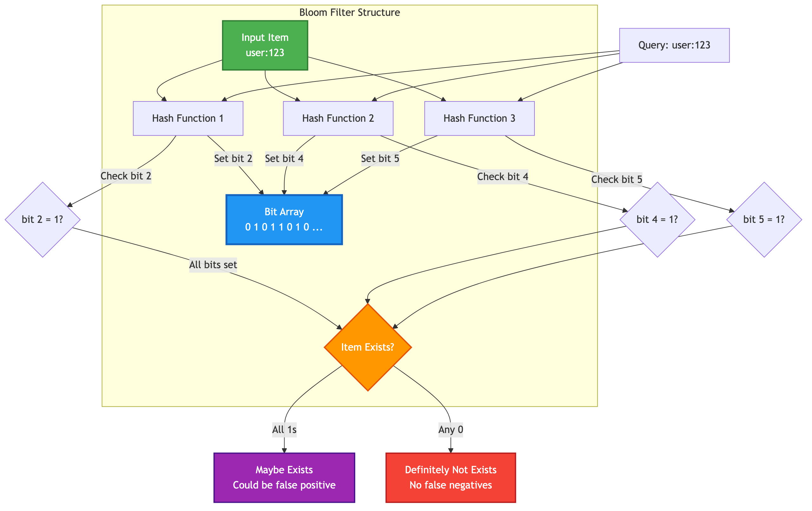

# 16-Bloom Filter Commands

SpinelDB provides a set of commands to interact with probabilistic Bloom filters. A Bloom filter is a space-efficient probabilistic data structure that is used to test whether an element is a member of a set. False positive matches are possible, but false negatives are not.

### Bloom Filter Structure



## BF.RESERVE key error_rate capacity

Creates a new Bloom filter with a specified error rate and initial capacity.

-   **key**: The name of the Bloom filter to create.
-   **error_rate**: The desired probability of false positives, a floating-point number between 0 and 1 (exclusive). A lower value means a lower false positive rate but requires more memory.
-   **capacity**: The expected number of items to be added to the filter. This influences the size of the filter.

**Return Value:**
-   `OK` on success.
-   Error if the key already exists or if `error_rate` or `capacity` are invalid.

**Examples:**

```
BF.RESERVE myapp:users:bloom 0.01 10000
```
This creates a Bloom filter named `myapp:users:bloom` that can hold approximately 10,000 items with a 1% chance of false positives.

## BF.ADD key item

Adds an item to a Bloom filter. If the Bloom filter specified by the key does not exist, it is implicitly created with default parameters (capacity 100, error rate 0.01).

-   **key**: The name of the Bloom filter.
-   **item**: The item to add to the filter.

**Return Value:**
-   `1` if the item was added (a new bit was set in the filter).
-   `0` if the item was already considered present in the filter (no bits were set).
-   Error if the key exists but holds a different data type.

**Examples:**

```
BF.ADD myapp:users:bloom user:123
BF.ADD myapp:users:bloom user:456
```

## BF.MADD key item [item ...]

Adds one or more items to a Bloom filter.

-   **key**: The name of the Bloom filter.
-   **item**: One or more items to add to the filter.

**Return Value:**
An array of integers, one for each item. Each integer is `1` if the corresponding item was added, and `0` if it was already present.

**Examples:**

```
BF.MADD myapp:users:bloom user:789 user:101 user:102
```

## BF.EXISTS key item

Checks if an item might be present in a Bloom filter.

-   **key**: The name of the Bloom filter.
-   **item**: The item to check for existence.

**Return Value:**
-   `1` if the item might exist in the Bloom filter (a false positive is possible).
-   `0` if the item definitely does not exist in the Bloom filter.
-   If the key does not exist, it is treated as if the item does not exist in an empty filter, returning `0`.
-   Error if the key exists but holds a different data type.

**Examples:**

```
BF.EXISTS myapp:users:bloom user:123  // Returns 1
BF.EXISTS myapp:users:bloom user:999  // Returns 0
```

## BF.MEXISTS key item [item ...]

Checks if one or more items might be present in a Bloom filter.

-   **key**: The name of the Bloom filter.
-   **item**: One or more items to check for existence.

**Return Value:**
An array of integers, one for each item. Each integer is `1` if the corresponding item might exist, and `0` if it definitely does not.

**Examples:**

```
BF.MEXISTS myapp:users:bloom user:123 user:999 user:456
```

## BF.INSERT key [CAPACITY capacity] [ERROR error_rate] ITEMS item [item ...]

Adds one or more items to a Bloom filter, creating the filter with specified options if it does not already exist.

-   **key**: The name of the Bloom filter.
-   **CAPACITY capacity**: (Optional) If the filter does not exist, this specifies the initial capacity.
-   **ERROR error_rate**: (Optional) If the filter does not exist, this specifies the error rate.
-   **ITEMS item [item ...]**: The item(s) to add. The `ITEMS` keyword is required.

**Return Value:**
An array of integers, one for each item. Each integer is `1` if the corresponding item was added, and `0` if it was already present.

**Examples:**

```
# Create a new filter and add items
BF.INSERT new:bloom CAPACITY 10000 ERROR 0.001 ITEMS user:a user:b

# Add items to an existing filter
BF.INSERT myapp:users:bloom ITEMS user:x user:y
```

## BF.INFO key

Returns detailed information about a Bloom filter.

-   **key**: The name of the Bloom filter.

**Return Value:**
An array of key-value pairs describing the filter's properties.
-   **Capacity**: The configured capacity of the filter.
-   **Size**: The size of the filter in bytes.
-   **Number of hash functions**: The number of hash functions used by the filter.
-   **Number of items inserted**: An estimated count of the number of items added to the filter.

**Examples:**

```
BF.INFO myapp:users:bloom
```

## BF.CARD key

Returns the number of items that have been added to a Bloom filter.

-   **key**: The name of the Bloom filter.

**Return Value:**
An integer representing the number of items added. If the key does not exist, returns `0`.

**Examples:**

```
BF.CARD myapp:users:bloom
```

## Error Conditions

-   `WRONGTYPE Operation against a key holding the wrong kind of value`: Occurs when attempting to use Bloom filter commands on a key that holds a different data type (e.g., a string or a list).
-   `Key already exists`: Returned by `BF.RESERVE` if a Bloom filter with the specified key already exists.
-   `Key not found`: Returned by `BF.INFO` if the key does not exist.
-   `Invalid request: ...`: Returned for various invalid parameter combinations, such as an invalid `error_rate` or attempting to change the parameters of an existing filter with `BF.INSERT`.
-   `Syntax error`: Returned for incorrectly formatted commands.

---

<div className="doc-nav-links">
  <span>⬅️ <strong>Previous Chapter: <a href="./troubleshooting">15. Operations & Troubleshooting</a></strong></span>
  <span>➡️ <strong>Next Chapter: <a href="./hyperloglog">17. HyperLogLogs</a></strong></span>
</div>