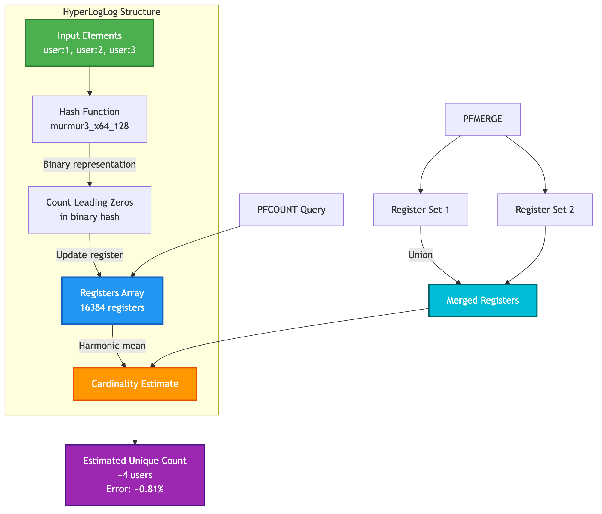

# Chapter 17: HyperLogLogs

HyperLogLog (HLL) is a probabilistic data structure used to estimate the number of unique elements (cardinality) in a dataset. Its magic lies in its ability to approximate the cardinality of millions of items using only a very small, constant amount of memory (around 16KB). This makes it ideal for counting unique visitors on a website, unique items searched, or other large-scale statistical data.

**Common Commands:** `PFADD`, `PFCOUNT`, `PFMERGE`

---

## How It Works

A HyperLogLog works by hashing the elements you add to it and using the binary representation of the hash to set registers. The number of leading zeros in the binary representation of the hash is used to estimate the cardinality. By combining the estimates from many registers, the HLL can provide a surprisingly accurate estimate of the true cardinality, with a standard error of about 0.81%.

### HyperLogLog Structure



## 1. `PFADD`

Adds one or more elements to a HyperLogLog.

**Command:** `PFADD key element [element ...]`

### Example Session

Let's count the number of unique users viewing a product page.

```shell
# Add some user IDs to the HLL for today.
# Note that "user:3" is added twice.
# The command returns 1 if an internal register was changed, 0 otherwise.
127.0.0.1:7878> PFADD page:views:2025-11-08 "user:1" "user:2" "user:3"
(integer) 1
127.0.0.1:7878> PFADD page:views:2025-11-08 "user:3" "user:4"
(integer) 1
```

---

## 2. `PFCOUNT`

Returns the estimated number of unique elements in one or more HyperLogLogs.

**Command:** `PFCOUNT key [key ...]`

### Example Session

```shell
# Get the estimated count of unique users for a single day
127.0.0.1:7878> PFCOUNT page:views:2025-11-08
(integer) 4

# Let's add another day's data
127.0.0.1:7878> PFADD page:views:2025-11-09 "user:4" "user:5" "user:6"
(integer) 1

# Get the estimated count of unique users for both days combined
127.0.0.1:7878> PFCOUNT page:views:2025-11-08 page:views:2025-11-09
(integer) 6
```

---

## 3. `PFMERGE`

Merges two or more HyperLogLogs into a single one. The resulting HLL will have a cardinality that is the union of the source HLLs.

**Command:** `PFMERGE destkey sourcekey [sourcekey ...]`

### Example Session

Let's merge the two daily HLLs into a weekly HLL.

```shell
# Merge the two daily HLLs into a new weekly HLL
127.0.0.1:7878> PFMERGE page:views:2025-W45 page:views:2025-11-08 page:views:2025-11-09
OK

# Get the estimated count of unique users for the week
127.0.0.1:7878> PFCOUNT page:views:2025-W45
(integer) 6
```

---

<div className="doc-nav-links">
  <span>⬅️ <strong>Previous Chapter: <a href="./bloom-filter">16. Bloom Filter Commands</a></strong></span>
  <span></span>
</div>
