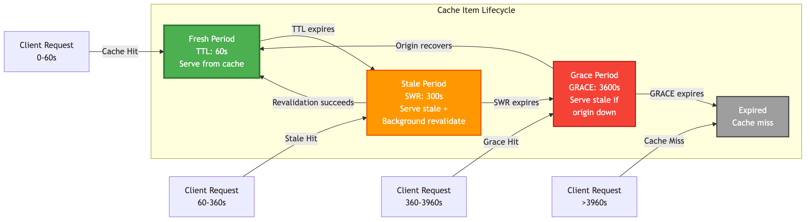

# Chapter 4a: Manual Caching with SWR & Grace Period

Welcome to the heart of SpinelDB: **The Intelligent Caching Engine**. This isn't just a simple key-value store with an expiration time; it's a sophisticated system designed to improve performance, increase resilience, and reduce load on your upstream services (origins).

This first guide covers the foundational "manual" caching commands. You'll learn how to store items in the cache and control their lifecycle using three powerful time-based options: **TTL**, **SWR**, and **GRACE**.

---

### The Cache Item Lifecycle

In a traditional cache, an item is either fresh (valid) or expired (invalid). SpinelDB introduces a more nuanced lifecycle with three distinct states, giving you fine-grained control over how content is served.

1.  **Fresh (`TTL`):** The "Time To Live". During this period, the content is considered fresh and is served directly from the cache. This is the fastest possible response.
2.  **Stale (`SWR`):** The "Stale-While-Revalidate" period. After the TTL expires, the content enters the SWR phase. During this time, SpinelDB will still serve the stale (expired) content to the user immediately, but it will *simultaneously* trigger a background, asynchronous request to the origin to fetch a fresh version. This means the user gets a fast response, and the cache updates itself without making the user wait.
3.  **Grace (`GRACE`):** The "Grace Period". If the SWR period also expires and the origin server is down or responding with an error, the cache enters the grace period. During this final window, SpinelDB will *continue* to serve the stale content to prevent users from seeing an error. It's a last line of defense for maximum availability.

### Cache Item Lifecycle



---

## 1. Storing Items with `CACHE.SET`

The `CACHE.SET` command is the primary way to manually place an item into the cache. It's similar to the standard `SET` command but includes options specific to the caching engine.

**Command:** `CACHE.SET key value [TTL seconds] [SWR seconds] [GRACE seconds] [REVALIDATE-URL url] [ETAG etag] [LAST-MODIFIED date] [VARY header-name] [COMPRESSION] [FORCE-DISK] [HEADERS key value ...] [TAGS tag1 tag2 ...]`

### Options Explained

*   **`ETAG etag`**: Specifies an ETag for the cached content. Useful for conditional requests and revalidation.
*   **`LAST-MODIFIED date`**: Specifies a Last-Modified date for the cached content. Also used for conditional requests.
*   **`VARY header-name`**: Indicates that the cached response varies depending on the specified request header(s). This allows SpinelDB to store multiple variants of the same key based on client request headers (e.g., `Accept-Encoding`).
*   **`COMPRESSION`**: If present, the `value` will be compressed using ZSTD before being stored in memory. This can save significant RAM for compressible content.
*   **`FORCE-DISK`**: If present, the `value` will be stored on disk instead of in memory, regardless of its size. This requires `cache.on_disk_path` to be configured.
*   **`HEADERS key value ...`**: Allows you to store arbitrary HTTP headers alongside the cached content. These can be used for `VARY` negotiation or simply for informational purposes. Provide key-value pairs.
*   **`TAGS tag1 tag2 ...`**: Associates one or more tags with the cached item. Tags are crucial for tag-based invalidation across a cluster.

### Example Session

Let's cache an API response for a user's profile. We want it to be fresh for 60 seconds. After that, we allow it to be served stale for another 5 minutes (300 seconds) while it revalidates in the background. If the origin is down, we'll serve the stale content for up to 1 hour (3600 seconds).

```shell
127.0.0.1:7878> CACHE.SET user:1:profile '{"id": 1, "name": "Alice"}' TTL 60 SWR 300 GRACE 3600
OK
```

**What happens now?**

*   **For the next 60 seconds:** Any `CACHE.GET user:1:profile` request will be served instantly from the cache.
*   **Between 60 seconds and 360 seconds (60 TTL + 300 SWR):** The first `CACHE.GET` request will receive the stale content immediately, and SpinelDB will start a background fetch. Subsequent requests will also get the stale content until the background fetch completes and updates the cache with a fresh version.
*   **Between 360 seconds and 3960 seconds (60 TTL + 300 SWR + 3600 GRACE):** If the origin is still down, `CACHE.GET` will *still* return the stale content, prioritizing availability over freshness.
*   **After 3960 seconds:** The item is fully expired and will be removed. A `CACHE.GET` will result in a cache miss.

---

## 2. Retrieving Items with `CACHE.GET`

The `CACHE.GET` command retrieves an item. Its behavior intelligently changes based on the item's state (fresh, stale, or grace).

**Command:** `CACHE.GET key [REVALIDATE url] [IF-NONE-MATCH etag] [IF-MODIFIED-SINCE date] [FORCE-REVALIDATE] [HEADERS key value ...]`

### Response Format

Unlike a simple `GET` command, `CACHE.GET` returns a RESP Array with three elements:

1.  **Status Code (Integer):** The HTTP status code of the cached response (e.g., `200` for OK, `404` for Not Found if negatively cached).
2.  **Headers (Array of Bulk Strings):** An array of key-value pairs representing the HTTP headers of the cached response (e.g., `["Content-Type", "application/json", "ETag", "\"abc\""]`).
3.  **Body (Bulk String):** The actual cached content.

If the item is not found or fully expired, `CACHE.GET` returns `(nil)`.

### The Role of `REVALIDATE-URL`

### The Role of `REVALIDATE-URL`

For the Stale-While-Revalidate and Grace periods to function automatically, SpinelDB needs to know *how* to fetch the fresh content. You provide this information in one of two ways:

1.  **On `CACHE.SET`:** You can specify the `REVALIDATE-URL` option when you first store the item. This is the most common and efficient method.
2.  **On `CACHE.GET`:** If you didn't provide it at set time, you can provide the URL with the `REVALIDATE` option on a `GET` command. This will trigger the revalidation if the item is stale.

### Conditional Revalidation with `IF-NONE-MATCH` and `IF-MODIFIED-SINCE`

SpinelDB supports standard HTTP conditional requests. You can pass `If-None-Match` (with an ETag) or `If-Modified-Since` (with a date) headers to `CACHE.GET`. If the cached content matches these conditions, SpinelDB will return a `(nil)` response, indicating a `304 Not Modified` status, without fetching the full body. This is useful for optimizing client-side caching.

```shell
# Example: Client has an old ETag and Last-Modified date
127.0.0.1:7878> CACHE.GET user:1:profile IF-NONE-MATCH "some-etag" IF-MODIFIED-SINCE "Tue, 15 Nov 1994 12:45:26 GMT"
(nil) # If the cached item's ETag/Last-Modified matches, no content is returned.
```

### Forcing Revalidation with `FORCE-REVALIDATE`

Sometimes, you might want to explicitly force SpinelDB to revalidate an item with its origin, regardless of its current freshness state. This is useful for administrative tasks or when you know the origin data has changed but haven't yet triggered a `PURGETAG`.

```shell
# This will force SpinelDB to fetch from the REVALIDATE-URL, even if the item is fresh.
127.0.0.1:7878> CACHE.GET user:1:profile FORCE-REVALIDATE
"{\"id\": 1, \"name\": \"Alice\", \"updated\": true}" # Returns the newly fetched content
```

### Negative Caching

SpinelDB can also cache negative responses (e.g., 404 Not Found, 500 Internal Server Error) from your origin. This prevents repeated requests to a failing or non-existent endpoint, reducing load on your upstream services. When a negative cache entry is hit, SpinelDB will return an error indicating the origin's status.

### Example Session

Let's continue with our previous example, assuming we set the revalidation URL initially.

```shell
# Set the item with its revalidation source, including a header and a tag
127.0.0.1:7878> CACHE.SET user:1:profile '{"id": 1, "name": "Alice"}' TTL 60 SWR 300 REVALIDATE-URL "https://api.myapp.com/users/1" HEADERS Content-Type application/json TAGS user-data
OK

# --- Within the first 60 seconds ---
127.0.0.1:7878> CACHE.GET user:1:profile
1) (integer) 200
2) 1) "Content-Type"
   2) "application/json"
3) "{\"id\": 1, \"name\": \"Alice\"}"
# (This is a cache hit)

# --- After 60 seconds have passed (item is now in SWR period) ---
127.0.0.1:7878> CACHE.GET user:1:profile
1) (integer) 200
2) 1) "Content-Type"
   2) "application/json"
3) "{\"id\": 1, \"name\": \"Alice\"}"
# (This is a STALE cache hit. The user gets the old data instantly,
# and SpinelDB is now fetching "https://api.myapp.com/users/1" in the background.)

# --- Example of a negatively cached response ---
# Assume a previous CACHE.FETCH or CACHE.PROXY to a non-existent URL resulted in a 404
127.0.0.1:7878> CACHE.GET non-existent-resource
1) (integer) 404
2) (empty array)
3) "Not Found"
```

This powerful combination of `TTL`, `SWR`, and `GRACE` gives you a robust defense against latency spikes and origin downtime, directly improving the user experience.

---

### A Note on Manual vs. Declarative Caching

The `CACHE.SET` and `CACHE.GET` commands provide fine-grained, manual control over the caching process. This is useful for specific scenarios where you need to manage the cache on a per-key basis.

However, for most applications, we recommend using the **Declarative Caching** approach with `CACHE.PROXY` and policies. This approach simplifies your application logic by offloading the caching decisions to SpinelDB, leading to cleaner, more maintainable code.

You can learn more about this in the next chapter.

➡️ **Next Chapter: [4b. Declarative Caching with Policies & `CACHE.PROXY`](./02-declarative-caching-proxy.md)**
