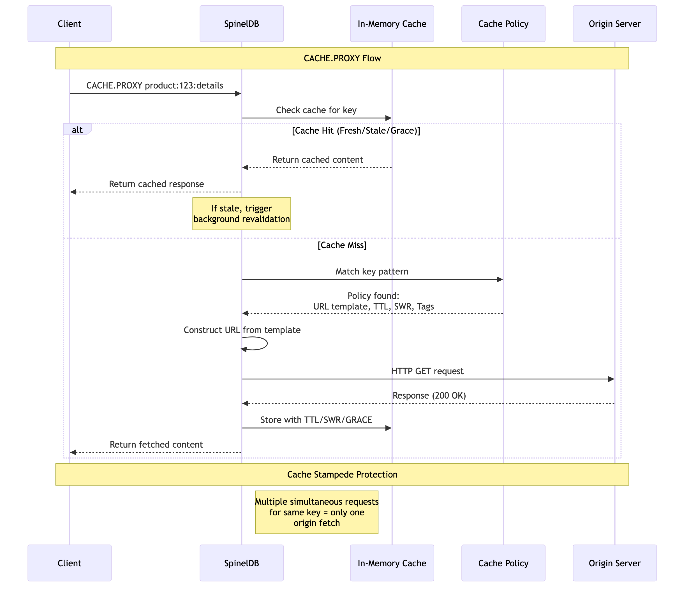

# Chapter 4b: Declarative Caching with CACHE.PROXY

The `CACHE.PROXY` command is a powerful feature that allows SpinelDB to act as a smart caching proxy, implementing a "get-or-fetch" pattern. Instead of your application manually checking the cache, fetching from an origin on a miss, and then storing the result, `CACHE.PROXY` automates this entire workflow.

When you execute `CACHE.PROXY`, SpinelDB will:
1.  Attempt to retrieve the content for the given `key` from its cache (similar to `CACHE.GET`).
2.  If a fresh or stale (within SWR/Grace) entry is found, it's returned immediately.
3.  If there's a cache miss (no entry, or fully expired), SpinelDB will:
    *   **Resolve the origin URL and caching options:** It will look for a matching `CachePolicy` based on the `key`. If a policy is found, it will use the policy's `url_template` and other caching directives (TTL, SWR, Grace, Tags, Vary). If no policy matches, you must provide the `url` directly in the `CACHE.PROXY` command.
    *   **Fetch from the origin:** It will perform an HTTP GET request to the resolved URL.
    *   **Store the result:** The fetched content (and its associated metadata) will be stored in the cache under the specified `key`, adhering to the resolved caching options.
    *   **Return the result:** The newly fetched and cached content is returned to the client.

This significantly simplifies your application logic, offloading complex caching decisions and network interactions to SpinelDB.

### CACHE.PROXY Flow



---

## Command Syntax

The basic syntax for `CACHE.PROXY` is as follows:

```
CACHE.PROXY key [url] [TTL seconds] [SWR seconds] [GRACE seconds] [TAGS tag1 tag2 ...] [VARY header-name] [HEADERS key value ...]
```

*   **`key`**: The cache key for the item. This key is used to look up existing cache entries and to match against configured `CachePolicy` patterns.
*   **`url` (Optional)**: The URL of the origin server to fetch content from if there's a cache miss. If a matching `CachePolicy` is configured with a `url_template`, this argument can be omitted.
*   **`TTL seconds`**: The Time-To-Live for the fresh content.
*   **`SWR seconds`**: The Stale-While-Revalidate period.
*   **`GRACE seconds`**: The Grace period.
*   **`TAGS tag1 tag2 ...`**: Associates tags with the cached item for tag-based invalidation.
*   **`VARY header-name`**: Specifies HTTP request headers that influence the cached response, allowing for content negotiation.
*   **`HEADERS key value ...`**: Allows you to pass arbitrary HTTP headers to the origin request. These can also be used for `VARY` negotiation.

**Note:** `TTL`, `SWR`, `GRACE`, `TAGS`, `VARY`, and `HEADERS` can be explicitly provided in the `CACHE.PROXY` command, or they can be inherited from a matching `CachePolicy`. Command-line arguments take precedence over policy settings.

---

## Simple Transparent Proxying

For many use cases, you don't need to configure a full `CachePolicy`. You can use `CACHE.PROXY` for simple, ad-hoc proxying by providing the URL directly.

Thanks to an ergonomic improvement, the command is even simpler if you want to use the URL itself as the cache key.

**Syntax:**
`CACHE.PROXY <url-as-key> [TTL seconds] [HEADERS key value ...]`

**How it Works:**
When the `key` provided to `CACHE.PROXY` is a valid URL and no other `url` argument is given, SpinelDB automatically uses the key as the URL to fetch on a cache miss.

**Example: Simple API Caching**

Let's cache a response from a public API for 5 minutes (300 seconds).

```shell
# First call, the URL is also the key
# SpinelDB will see a cache miss and fetch from the URL.
127.0.0.1:7878> CACHE.PROXY "https://api.github.com/users/octocat" TTL 300
1) (integer) 200
2) 1) "Content-Type"
   2) "application/json; charset=utf-8"
3) "{\"login\":\"octocat\",\"id\":583231,...}"
# Analysis:
# 1. Cache miss for key "https://api.github.com/users/octocat".
# 2. SpinelDB fetches from this URL.
# 3. The response is stored in the cache with a 300-second TTL.
# 4. The response is returned to the client.

# Second call within 5 minutes
127.0.0.1:7878> CACHE.PROXY "https://api.github.com/users/octocat"
1) (integer) 200
2) 1) "Content-Type"
   2) "application/json; charset=utf-8"
3) "{\"login\":\"octocat\",\"id\":583231,...}"
# Analysis:
# 1. Cache hit for key "https://api.github.com/users/octocat".
# 2. The content is served directly from the cache.
```

This simple mode is perfect for quickly caching external API calls without the overhead of defining policies. For more complex scenarios involving dynamic URLs, tags, and other rules, using `CachePolicy` is the recommended approach.

---

## How Policies Work with `CACHE.PROXY`

`CACHE.PROXY` is designed to work seamlessly with **`CachePolicy`** definitions (configured via the `CACHE.POLICY` command, detailed in a later chapter). A `CachePolicy` allows you to define declarative rules for caching, including:
*   A `key_pattern` (e.g., `products:*:details`) to match cache keys.
*   A `url_template` (e.g., `https://api.example.com/products/{1}/details`) that can dynamically construct the origin URL based on the cache key or client request headers.
*   Default `TTL`, `SWR`, `GRACE` periods.
*   Automatic `tags` generation.
*   `Vary` headers to consider.
*   Whether to `prewarm` the cache.

When `CACHE.PROXY` is called, SpinelDB will automatically find the highest-priority `CachePolicy` whose `key_pattern` matches the provided `key`. If a match is found, the policy's settings will be used to guide the fetch and caching process.

---

## Usage Example

Let's set up a `CachePolicy` first (you'd typically do this once in your configuration or via `CACHE.POLICY` command):

```shell
# Example Policy: Cache product details
# Matches keys like "product:123:details"
# Fetches from "https://api.example.com/products/123/details"
# Sets TTL=300s, SWR=60s, GRACE=30s
# Adds a dynamic tag "product:{1}"
127.0.0.1:7878> CACHE.POLICY product-details KEY-PATTERN "product:*:details" URL-TEMPLATE "https://api.example.com/products/{1}/details" TTL 300 SWR 60 GRACE 30 TAGS "product:{1}"
OK
```

Now, let's use `CACHE.PROXY` for a product details key:

```shell
# First call for a new key
127.0.0.1:7878> CACHE.PROXY product:123:details
1) (integer) 200
2) 1) "Content-Type"
   2) "application/json"
3) "{\"id\": 123, \"name\": \"Example Product\"}"
# Analysis:
# 1. Cache miss for "product:123:details".
# 2. SpinelDB matches the "product-details" policy.
# 3. It constructs the URL: "https://api.example.com/products/123/details".
# 4. Fetches content from the origin.
# 5. Stores the content in cache with TTL=300, SWR=60, GRACE=30, and tag "product:123".
# 6. Returns the fetched content.

# Subsequent call (within TTL)
127.0.0.1:7878> CACHE.PROXY product:123:details
1) (integer) 200
2) 1) "Content-Type"
   2) "application/json"
3) "{\"id\": 123, \"name\": \"Example Product\"}"
# Analysis:
# 1. Cache hit for "product:123:details".
# 2. Content is served directly from cache, no origin fetch.

# Call with explicit TTL (overrides policy)
127.0.0.1:7878> CACHE.PROXY product:456:details TTL 600
1) (integer) 200
2) 1) "Content-Type"
   2) "application/json"
3) "{\"id\": 456, \"name\": \"Another Product\"}"
# Analysis:
# 1. Cache miss for "product:456:details".
# 2. SpinelDB matches the "product-details" policy for URL and tags.
# 3. However, the explicit TTL 600s from the command overrides the policy's TTL 300s.
# 4. Fetches, stores with TTL 600s, and returns.
```

### Advanced Features of `CACHE.PROXY`

*   **Cache Stampede Protection:** If multiple clients request the same missing key simultaneously, `CACHE.PROXY` ensures that only *one* request goes to the origin. Subsequent requests for that key will wait for the first fetch to complete and then receive the same result, preventing your origin from being overwhelmed.
*   **Lazy Lock Release:** When a cache miss occurs and an origin fetch is initiated, SpinelDB intelligently releases the database locks before performing the potentially long-running HTTP request. This maximizes concurrency and keeps the database responsive.
*   **Dynamic URL Construction:** The `url_template` in `CachePolicy` supports placeholders like `{N}` (from key pattern captures) and `{hdr:Header-Name}` (from client request headers), allowing for highly dynamic origin URLs.
*   **Negative Caching:** If the origin responds with a non-200 status (e.g., 404, 500), SpinelDB can cache this negative response for a configurable period, preventing repeated requests to a failing or non-existent endpoint.

`CACHE.PROXY` empowers you to build highly efficient and resilient applications by centralizing and automating your caching logic within SpinelDB.

---

<div className="doc-nav-links">
  <span>⬅️ <strong>Previous Chapter: <a href="./01-manual-caching-swr">4a. Manual Caching with SWR & Grace Period</a></strong></span>
  <span>➡️ <strong>Next Chapter: <a href="./03-tag-based-invalidation">4c. Tag-Based Invalidation</a></strong></span>
</div>
