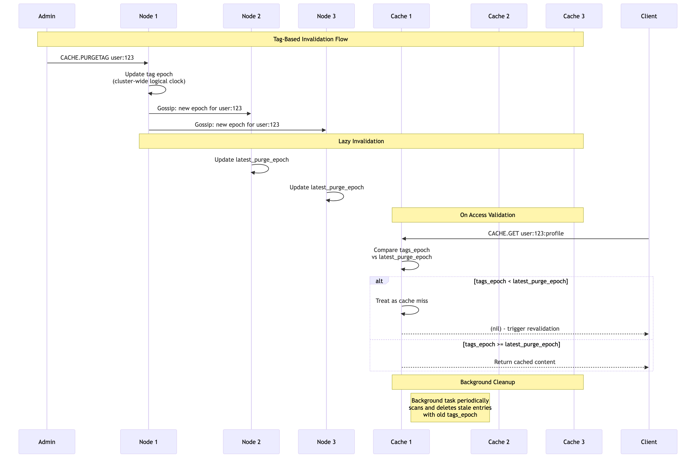

# Chapter 4c: Tag-Based Invalidation

Tag-based invalidation is a powerful feature that allows you to invalidate multiple cache entries at once, even if they don't share a common key pattern. This is especially useful when a single piece of data is used in multiple cached results.

## The Problem

Imagine you have an e-commerce application. You might cache:
*   The user's profile (`GET user:123`)
*   The user's recent orders (`LGET orders:user:123`)
*   The user's shopping cart (`HGETALL cart:user:123`)

If the user updates their profile, you would need to manually invalidate all three of these cache entries. This can be complex and error-prone.

## The Solution: Tags

With tags, you can associate multiple cache entries with a single tag. Then, you can invalidate all entries associated with that tag in a single command.

### Using Tags with `CACHE.SET` and `CACHE.PROXY`

You can associate tags with a cached item in two primary ways:

1.  **Manually with `CACHE.SET`**: When you directly store an item using `CACHE.SET`, you can provide tags as part of the command.
2.  **Declaratively with `CACHE.PROXY` and Policies**: When using `CACHE.PROXY`, tags can be automatically applied based on a matching `CachePolicy`.

Tags can be static (e.g., `"product-category:electronics"`) or dynamic, using placeholders from the cache key pattern (e.g., `"user:{1}"`).

### Example: Associating Tags

#### 1. Using `CACHE.SET` with explicit tags

You can directly associate tags when manually setting a cache entry:

```shell
127.0.0.1:7878> CACHE.SET user:123:profile '{"id": 123, "name": "Alice"}' TTL 3600 TAGS user:123 profile-data
OK
127.0.0.1:7878> CACHE.SET user:123:orders '[{"order_id": "A1", "item": "Book"}]' TTL 3600 TAGS user:123 order-data
OK
```

#### 2. Using `CACHE.PROXY` with a `CachePolicy` for dynamic tags

First, define a policy that generates dynamic tags based on the key pattern:

```shell
# Policy to cache product details, with a dynamic tag based on product ID
127.0.0.1:7878> CACHE.POLICY product-details KEY-PATTERN "product:*:details" URL-TEMPLATE "https://api.example.com/products/{1}/details" TTL 300 TAGS "product:{1}"
OK
```

Now, when you use `CACHE.PROXY` with a key matching this policy, the tag will be automatically applied:

```shell
127.0.0.1:7878> CACHE.PROXY product:456:details
1) (integer) 200
2) 1) "Content-Type"
   2) "application/json"
3) "{"id": 456, "name": "Example Product"}"
# This entry is now tagged with "product:456"
```

---

## Invalidate by Tag with `CACHE.PURGETAG`

When the underlying data changes, you can invalidate all associated cache entries using the `CACHE.PURGETAG` command. This command is designed for **cluster-wide invalidation**.

**Command:** `CACHE.PURGETAG tag1 [tag2 ...]`

### Example: Purging User Data

If user `123` updates their profile, you can invalidate all related cache entries (both `user:123:profile` and `user:123:orders`) with a single command:

```shell
127.0.0.1:7878> CACHE.PURGETAG user:123
(integer) 2 # Indicates 2 tags were processed (in this simple case, just one tag was given)
```

**How `CACHE.PURGETAG` Works (Cluster-Wide):

1.  **Tag Epoch Update:** When `CACHE.PURGETAG` is executed on any node in the cluster, SpinelDB updates a cluster-wide logical clock (an "epoch") for that specific tag. This new epoch is then gossiped to all other nodes in the cluster.
2.  **Lazy Invalidation:** Cache entries are *not* immediately deleted. Instead, each cached item has its own `tags_epoch` (the epoch of its associated tags at the time of caching).
3.  **Validation on Access:** When a `CACHE.GET` or `CACHE.PROXY` request comes in, SpinelDB compares the cached item's `tags_epoch` with the current `latest_purge_epoch` for all its associated tags. If the item's `tags_epoch` is older than any of its tags' `latest_purge_epoch`, the item is considered stale and will be treated as a cache miss (triggering a revalidation or fetch from origin).
4.  **Background Cleanup:** A dedicated background task (`CacheTagValidatorTask`) periodically samples cache entries. If it finds an entry whose `tags_epoch` is older than the current `latest_purge_epoch` for any of its tags, it will proactively delete that entry from the cache. This ensures that stale entries are eventually removed, even if they are not accessed.

This lazy, cluster-aware invalidation mechanism ensures that your cache remains consistent across all nodes without requiring expensive, blocking operations.

### Tag-Based Invalidation Flow



---

➡️ **Next Chapter: [4d. On-Disk Caching](./04d-on-disk-caching.md)**