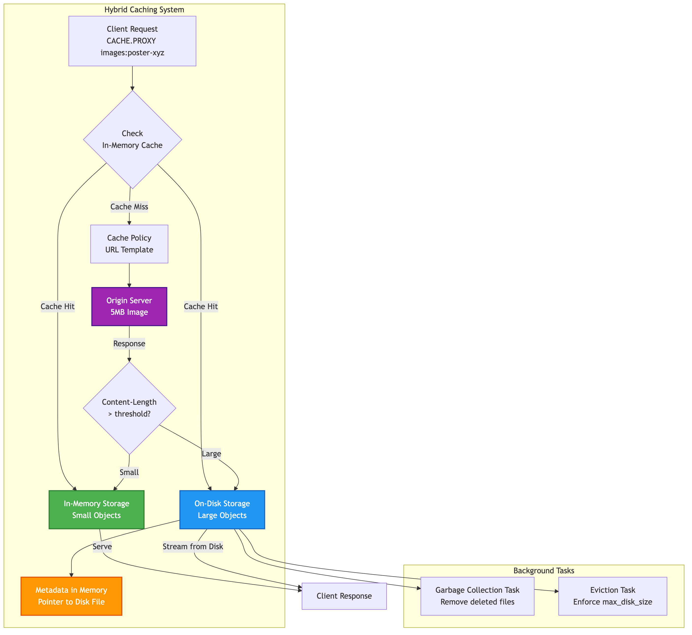

# Chapter 4d: Handling Large Objects with On-Disk Caching

A common challenge with in-memory caches is managing large objects. Storing assets like high-resolution images, videos, or large JSON API responses directly in memory can quickly exhaust your server's RAM, leading to aggressive eviction of smaller, more frequently accessed items.

SpinelDB solves this problem with its **hybrid on-disk caching** mechanism. You can define a size threshold; any cacheable object larger than this threshold will be automatically streamed to a temporary file on disk instead of being stored in RAM.

This gives you the best of both worlds:
*   **Speed:** Small, hot data remains in memory for the lowest possible latency.
*   **Capacity:** Large, less frequently accessed objects are offloaded to disk, dramatically increasing your effective cache capacity without consuming precious RAM.

The entire process is transparent to the client. A `CACHE.GET` or `CACHE.PROXY` request works identically whether the item is in memory or on disk.

### Hybrid On-Disk Caching Flow



---

## 1. Configuring On-Disk Caching

On-disk caching is configured with two settings in your `config.toml` file, under the `[cache]` section, and can also be controlled via command options.

*   `on_disk_path`: The directory path where SpinelDB will store the cache files. **The server must have write permissions to this directory.**
*   `streaming_threshold_bytes`: The size in bytes. Any object returned from an origin server with a `Content-Length` header greater than this value will be streamed to disk.
*   `max_disk_size`: The maximum total size in bytes that the on-disk cache can occupy. If this limit is exceeded, SpinelDB will automatically evict the oldest files to free up space.

### Example Configuration

Let's configure SpinelDB to store any object larger than 1 megabyte on disk in a directory named `spineldb_cache_files`, with a total disk limit of 10 gigabytes.

```toml
# In your config.toml

[cache]
# The directory to store large cache files. It will be created if it doesn't exist.
on_disk_path = "spineldb_cache_files"

# Set the threshold to 1MB (1024 * 1024 bytes).
streaming_threshold_bytes = 1048576

# Set the maximum total disk size to 10GB (10 * 1024 * 1024 * 1024 bytes).
max_disk_size = 10737418240
```

### Forcing On-Disk Storage with `FORCE-DISK`

Even if an item is smaller than `streaming_threshold_bytes`, you can explicitly force it to be stored on disk using the `FORCE-DISK` option with `CACHE.SET` or `CACHE.PROXY` (via a `CachePolicy`). This is useful for items you know will grow large or if you want to minimize RAM usage for specific content.

```shell
127.0.0.1:7878> CACHE.SET small:image "<binary_data>" FORCE-DISK
OK
```

After setting this, restart your SpinelDB server for the changes to take effect.

---

## 2. The Workflow in Action

You don't need to change any of your `CACHE.*` commands to use this feature. SpinelDB handles the logic automatically during the fetch process.

Let's trace a `CACHE.PROXY` request for a large file.

**Scenario:** A client requests `CACHE.PROXY images:product:poster-xyz`

1.  **Cache Miss:** SpinelDB checks for the key in memory and finds it's not there.
2.  **Policy Lookup:** It finds a matching cache policy with the URL `https://cdn.myapp.com/images/poster-xyz.jpg`.
3.  **Origin Fetch:** SpinelDB sends a `GET` request to the origin URL.
4.  **Size Check:** The origin responds with the image data and a `Content-Length: 5000000` header (5 MB).
5.  **Decision:** SpinelDB sees that 5,000,000 bytes is greater than the configured `streaming_threshold_bytes` (1,048,576).
6.  **Stream to Disk:** Instead of buffering the 5 MB response in memory, SpinelDB creates a temporary file in the `spineldb_cache_files` directory and streams the response body directly into it.
7.  **Store Metadata:** Once the download is complete, SpinelDB stores the metadata for the cache item (TTL, SWR, tags, etc.) in its main in-memory database, along with a **pointer** to the file on disk. The large image data itself is *not* in RAM.
8.  **Serve Client:** SpinelDB serves the content to the original client.

### Subsequent Requests

When another client requests `CACHE.PROXY images:product:poster-xyz`:
1.  **Cache Hit:** SpinelDB finds the key in memory.
2.  **Metadata Check:** It sees that the body of the object is located on disk at a specific path.
3.  **Stream from Disk:** SpinelDB opens the file from disk and streams its contents directly to the client's socket. This is a significant performance optimization, as the large object is never fully loaded into the server's main memory, reducing memory pressure and improving throughput.

The object is served efficiently without ever being fully loaded into the server's main memory.

---

## 3. On-Disk Cache Management

SpinelDB automatically manages the lifecycle of these on-disk files through two dedicated background tasks:

1.  **Garbage Collection (`OnDiskCacheGCTask`):** This task periodically scans the cache directory and the manifest file (`spineldb-cache.manifest`). It is responsible for:
    *   Removing files that have been explicitly marked for deletion (`PendingDelete` status in the manifest) when their associated in-memory cache entry is removed (due to TTL expiration, `DEL`, `CACHE.PURGE`, or `CACHE.PURGETAG`).
    *   Cleaning up any orphaned files that might have been left behind from an unclean shutdown or a failed write operation (`Pending` status in the manifest).

2.  **Eviction (`OnDiskCacheEvictionTask`):** This task enforces the `max_disk_size` limit. It periodically checks the total size of the committed cache files on disk. If the `max_disk_size` is exceeded, it will:
    *   Identify the oldest files (based on their timestamp in the manifest).
    *   Mark these files as `PendingDelete` in the manifest until the total disk usage falls below the configured limit. The actual file deletion is then handled by the Garbage Collection task.

This two-tiered approach ensures your disk usage doesn't grow indefinitely and that files are cleaned up efficiently.

### Benefits of Hybrid Caching

*   **Vastly Increased Cache Capacity:** Your cache is no longer limited by RAM but by available disk space, which is typically much cheaper and more plentiful.
*   **Improved Memory Stability:** Prevents large, infrequent requests from evicting many small, frequently used items, leading to a more stable cache hit ratio.
*   **Reduced Memory Fragmentation:** Offloading large allocations to the filesystem can help reduce memory fragmentation in the main server process over time.

This hybrid approach makes SpinelDB an exceptionally powerful and memory-efficient caching solution for a wide range of content types.

---

<div style="display: flex; justify-content: space-between;">
  <span>⬅️ <strong>Previous Chapter: <a href="./03-tag-based-invalidation.md">4c. Tag-Based Invalidation</a></strong></span>
  <span>➡️ <strong>Next Chapter: <a href="./05-content-negotiation-vary.md">4e. Content Negotiation with Vary</a></strong></span>
</div>
