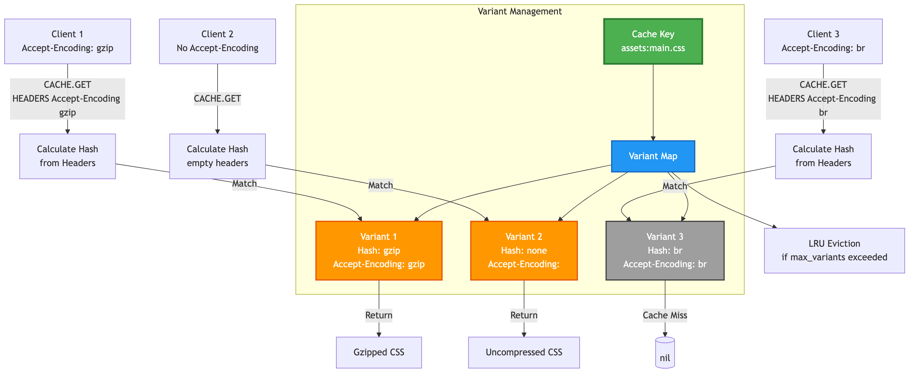

# Chapter 4e: Content Negotiation with `Vary`

Modern web applications often serve different versions, or **variants**, of the same resource based on the client's request headers. This is a core part of HTTP content negotiation.

Common examples include:
*   **Compression:** Serving a `gzip` or `br` compressed response to clients that support it (via the `Accept-Encoding` header), but an uncompressed version to those that don't.
*   **Localization:** Serving a response in English or French based on the client's `Accept-Language` header.
*   **Device Type:** Serving a different HTML layout for mobile vs. desktop clients based on the `User-Agent` header.

A simple cache that only uses the URL as a key will fail in these scenarios. It might incorrectly cache the `gzip` version and serve it to a client that doesn't understand it, resulting in a broken response.

SpinelDB solves this by natively supporting the `Vary` HTTP header. The `Vary` header tells the cache which request headers should be considered part of the cache key.

---

## 1. How `Vary` Works in SpinelDB

When you store a cache item with a `Vary` directive, SpinelDB creates a **variant map** for that key. Instead of storing a single body, it stores multiple bodies, each corresponding to a unique combination of the specified header values.

### Variant Management and Content Negotiation



### Variant Management

To prevent unbounded growth of variants for a single key, SpinelDB allows you to configure a `max_variants_per_key` limit in your `config.toml` (under the `[cache]` section). If this limit is reached when a new variant is being added, the **least recently accessed (LRU)** variant for that key will be automatically evicted to make space.

**Workflow:**
1.  **`CACHE.SET` with `VARY`:** You store an object and specify which headers it varies on (e.g., `VARY "Accept-Encoding"`). You also provide the request headers that led to this specific response (e.g., `HEADERS "Accept-Encoding" "gzip, deflate, br"`).
2.  **Variant Hash:** SpinelDB calculates a unique hash based on the values of the `Vary` headers and any additional `HEADERS` provided. This hash ensures that each unique combination of request headers (relevant to the `Vary` directive) maps to a distinct cached variant.
3.  **Store Variant:** The response body is stored in a map under this hash.
4.  **`CACHE.GET` with `HEADERS`:** When a client requests the object, they provide their own set of request headers (e.g., `HEADERS "Accept-Encoding" "deflate"`).
5.  **Hash and Lookup:** SpinelDB calculates a new hash from the incoming headers and looks for a matching variant in the map. If a match is found, that specific version is served. If not, it's a cache miss for that variant.

---

### Using `Vary` with `CACHE.PROXY` and `CachePolicy`

For declarative caching with `CACHE.PROXY`, you can define the `vary_on` headers directly in your `CachePolicy`.

```shell
# Example Policy: Cache images, varying on Accept-Encoding
127.0.0.1:7878> CACHE.POLICY images KEY-PATTERN "images:*" URL-TEMPLATE "https://cdn.example.com/{1}.jpg" TTL 86400 VARY-ON "Accept-Encoding"
OK
```

When a `CACHE.PROXY` request matches this policy, SpinelDB will automatically:
1.  Extract the `Accept-Encoding` header from the client's request.
2.  Include this header when fetching from the origin.
3.  Use this header to determine the correct variant for caching and retrieval.

This allows you to define complex content negotiation rules once in your policies, and `CACHE.PROXY` will handle the rest transparently.

---

## 2. Caching with `VARY` and `HEADERS`

Let's walk through a practical example of caching a compressed asset.

**Commands:**
*   `CACHE.SET key value ... VARY "Header1,Header2" HEADERS Header1 Value1 Header2 Value2 ...`
*   `CACHE.GET key HEADERS Header1 Value1 Header2 Value2 ...`

### Example Session

Imagine our origin server responds with a gzipped CSS file. The HTTP response would include `Vary: Accept-Encoding`. We need to tell SpinelDB about this.

**Step 1: Cache the Gzipped Variant**

Our application fetches the resource and receives a gzipped body. The request that triggered this had the header `Accept-Encoding: gzip`. We store it like this:

```shell
# The value is the actual gzipped binary data.
# We specify that this response varies on "Accept-Encoding".
# We provide the specific request header that generated this variant.
127.0.0.1:7878> CACHE.SET assets:main.css <gzipped_data> TTL 3600 VARY "Accept-Encoding" HEADERS "Accept-Encoding" "gzip"
OK
```

**Step 2: Cache the Uncompressed Variant**

Later, a client that does not support gzip requests the same CSS file. Our application fetches the uncompressed version from the origin and caches it.

```shell
# This time, we cache the uncompressed data.
# The VARY header is the same, but the HEADERS value is different (or absent).
127.0.0.1:7878> CACHE.SET assets:main.css <uncompressed_data> TTL 3600 VARY "Accept-Encoding"
OK
```
*(Note: Not providing any `HEADERS` is equivalent to an empty set of headers for the variant hash.)*

Now, the key `assets:main.css` in SpinelDB holds two variants.

---

## 3. Retrieving the Correct Variant

When clients request the resource, they must provide their relevant headers to `CACHE.GET` (or `CACHE.PROXY`) so SpinelDB can serve the correct version.

### Example Session

**Request from a Gzip-capable client:**

```shell
127.0.0.1:7878> CACHE.GET assets:main.css HEADERS "Accept-Encoding" "gzip, deflate"
# SpinelDB calculates a hash based on "gzip, deflate" and finds the gzipped variant.
# It returns the <gzipped_data>.
(binary data)
```

**Request from a client with no compression support:**

```shell
127.0.0.1:7878> CACHE.GET assets:main.css
# SpinelDB calculates a hash based on the absence of the Accept-Encoding header.
# It finds the uncompressed variant.
# It returns the <uncompressed_data>.
(text data)
```

**Request from a client that only supports `br`:**

```shell
127.0.0.1:7878> CACHE.GET assets:main.css HEADERS "Accept-Encoding" "br"
# SpinelDB calculates a hash for "br", but no such variant has been cached yet.
# This is a cache miss.
(nil)
```
If this were a `CACHE.PROXY` call, the miss would trigger a fetch from the origin, and the new `br` variant would then be cached.

### Smart Header Normalization

SpinelDB is intelligent about how it generates the variant hash. For common headers like `Accept-Encoding` and `Accept-Language`, it normalizes the values to improve the hit ratio. This means that variations in whitespace or order of values in the header will still result in the same variant being served, increasing cache efficiency. For example:
*   `Accept-Encoding: gzip, deflate` will produce the same hash as `Accept-Encoding: deflate, gzip`.
*   `Accept-Language: en-US,en;q=0.9` will produce the same hash as `Accept-Language: en,en-US`.

---

### Building a Truly Robust Cache

By correctly using the `Vary` header, you can build a cache that respects content negotiation and serves the right content to every user, every time. This is a critical feature for any high-performance web or API caching layer.

This concludes our deep dive into the Intelligent Caching Engine. You now have the tools to build a fast, resilient, and efficient caching strategy.

---

<div style="display: flex; justify-content: space-between;">
  <span>⬅️ <strong>Previous Chapter: <a href="./04-on-disk-caching.md">4d. On-Disk Caching</a></strong></span>
  <span>➡️ <strong>Next Chapter: <a href="../06-replication.md">5. Primary-Replica Replication</a></strong></span>
</div>
